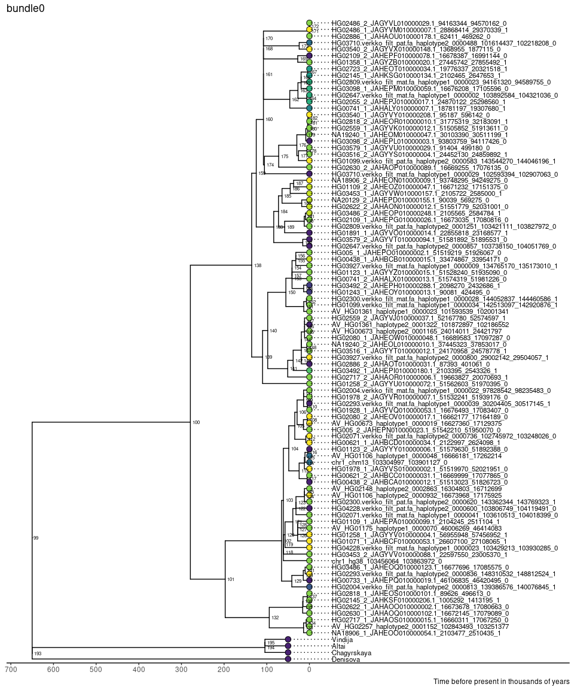
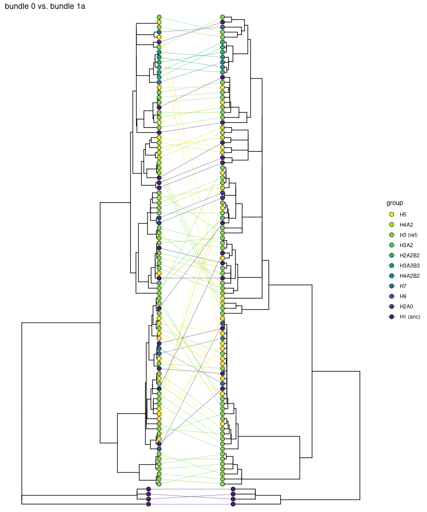

Examination of bundle sequences
================

- <a href="#structure-tree" id="toc-structure-tree">Structure tree</a>
- <a href="#extract-all-bundle-sequences-from-the-fasta-file"
  id="toc-extract-all-bundle-sequences-from-the-fasta-file">Extract all
  bundle sequences from the fasta file</a>
- <a href="#extract-neanderthal-and-denisovan-sequences-as-outgroups"
  id="toc-extract-neanderthal-and-denisovan-sequences-as-outgroups">Extract
  Neanderthal and Denisovan sequences as outgroups</a>
- <a
  href="#multiple-sequence-alignment-and-tree-construction-with-kalign3-and-iqtree"
  id="toc-multiple-sequence-alignment-and-tree-construction-with-kalign3-and-iqtree">Multiple
  sequence alignment and tree construction (with kalign3 and iqtree)</a>
- <a href="#tree-visualization" id="toc-tree-visualization">Tree
  visualization</a>
  - <a href="#all-alignments" id="toc-all-alignments">All alignments</a>
  - <a href="#rectangular" id="toc-rectangular">Rectangular</a>
  - <a href="#iqtree-vs-neighbor-joining"
    id="toc-iqtree-vs-neighbor-joining">IQTree vs. Neighbor-joining</a>
  - <a href="#trees-with-first-vs-second-half-of-bundle-1"
    id="toc-trees-with-first-vs-second-half-of-bundle-1">Trees with first
    vs. second half of bundle 1</a>
  - <a href="#bundle-0-vs-1a" id="toc-bundle-0-vs-1a">Bundle 0 vs. 1a</a>
  - <a href="#plot-with-3-trees" id="toc-plot-with-3-trees">Plot with 3
    trees</a>
- <a href="#diversity" id="toc-diversity">Diversity</a>

``` r
library(tidyverse)
library(ggtree)
library(treeio)
library(caper)
library(tidytree)
library(pegas)
library(phytools)
library(cowplot)
```

## Structure tree

Note that HG002 and HG02723#1 are removed from all analyses due to
misassembly. hg19 is the same as hg38, and will be removed as well

``` r
hap_struc_table <- read_tsv("../combined_y1_y2_analyses/output/haplotype_all_structures.tsv") %>%
  mutate(contig=str_replace_all(contig, ":", "_"),
         contig=str_replace_all(contig, "#", "_"),
         contig=str_replace_all(contig, "-", "_")) #%>%
  # filter(! str_detect(contig, "^HG002"),
  #        ! str_detect(contig, "^HG02723_1"),
  #        ! str_detect(contig, "hg19"))
gene_count <- read_tsv("../combined_y1_y2_analyses/output/haplotype_assignments.txt") %>%
  mutate(chrom=str_replace_all(chrom, ":", "_"),
         chrom=str_replace_all(chrom, "#", "_"),
         chrom=str_replace_all(chrom, "-", "_"),
         haplotype=case_when(haplotype=="H3^r"~"H3 (ref)",
                             haplotype=="H1^a"~"H1 (anc)",
                             TRUE~haplotype)) %>%
  # filter(! str_detect(chrom, "^HG002"),
  #        ! str_detect(chrom, "^HG02723_1"),
  #        ! str_detect(chrom, "hg19")) %>%
  group_by(hap_struc_d) %>%
  mutate(hap_struc_d_n=n()) %>%
  ungroup()
structure_tree <- read.newick("../combined_y1_y2_analyses/output/pggb_clusters/haplotype_structures_tree.nwk") #%>%
    # treeio::drop.tip(tip = c("HG002.verkko_filt_pat.fa-haplotype2-0000649_147937390_148315979_1"))
amy_color <- MetBrewer::met.brewer("Klimt", 4, "discrete")
group_color <- viridis::viridis(n = 12, direction = -1)
haplotype_fct_order <- c("H5", "H4A2", "H3 (ref)", "H3A2", "H2A2B2", "H3A3B3", "H4A2B2", "H7", "H9", "H2A0", "H1 (anc)")
cladelab_df <- tibble(name=haplotype_fct_order %>% as_factor(),
                      node=c(42, 39, 53, 24, 23, 36, 6, 33, 3, 2, 1))
structure_ggtree <- structure_tree %>%
  as_tibble() %>%
  mutate(label=str_replace_all(label, "-", "_"),
         label=str_replace_all(label, ":", "_"),
         label=str_replace_all(label, "#", "_")) %>%
  left_join(gene_count, by=c("label"="chrom")) %>%
  mutate(haplotype=fct_relevel(haplotype, haplotype_fct_order)) %>%
  as.treedata() %>%
  #ggtree(aes(color=haplotype), linewidth=1) +
  ggtree(color="darkgrey", linewidth=1) +
  scale_color_manual(values = c(group_color), guide="none") +
  geom_tiplab(align=FALSE, mapping = aes(label=str_pad(max(y)-y+1, 2, pad="0")), size=3, offset = 0.02, color="black") +
  #geom_tiplab(align=FALSE, mapping = aes(label=haplotype), size=3, offset = 0.02, color="black") +
  geom_tippoint(aes(size=hap_struc_d_n, fill=haplotype), shape=21, color="black") +
  geom_cladelab(data = cladelab_df, mapping = aes(node = node, label = name, color=name), align=TRUE, geom='text', offset=.06, offset.text=0.02, fontface = 2, parse=TRUE) +
  scale_fill_manual(values = group_color, guide="none") +
  scale_color_manual(values = group_color, guide="none") +
  #geom_text2(aes(label=node), hjust=-.3, size=2) +
  labs(size="n") +
  xlim_tree(0.38) +
  theme(legend.position=c(0.15, 0.9))
structure_ggtree
```

<!-- -->

``` r
structure_ggtree_order <- structure_ggtree$data %>%
  filter(!is.na(label)) %>%
  mutate(node_rank = length(label)-y+1) %>%
  mutate(node_rank = str_pad(node_rank, 2, pad = "0")) %>%
  dplyr::select(label, hap_struc_d, node_rank)

# structure_ggtree_tmp <-  structure_tree_grouped %>%
#   left_join(structure_ggtree_order) %>%
#   as.treedata() %>%
#   ggtree(aes(color=group), linewidth=1) +
#   scale_color_manual(values = c("black",group_color), guide="none") +
#   geom_tippoint(aes(size=n, fill=group), shape=21, color="black") +
#   scale_fill_manual(values = group_color, guide="none") +
#   #geom_text2(aes(subset=!isTip, label=node), hjust=-.3, size=2) +
#   xlim_tree(0.33)
# structure_ggtree <- structure_ggtree_tmp +
#   geom_tiplab(align=TRUE, mapping = aes(label=amy_copy_number), size=3, offset = 0.04, color="black")
#nice example where this came from: https://www.janknappe.com/blog/r-irish-elections-gender/
histo_dots <- gene_count %>%
  filter(chrom %in% structure_ggtree_order$label) %>%
  dplyr::select(chrom, hap_struc_d, AMY1, AMY2A, AMY2Ap, AMY2B) %>%
  pivot_longer(3:6, values_to = "n", names_to = "name") %>%
  uncount(n) %>%
  arrange(chrom, hap_struc_d, name) %>%
  group_by(chrom, hap_struc_d) %>%
  mutate(index=row_number()) %>%
  ungroup()
histo_dots_plot <- histo_dots %>%
  ggplot(aes(x=index, y=chrom, fill=name, shape=name)) +
  geom_point(size=3) +
  scale_shape_manual(values = 22:25) +
  scale_fill_manual(values = amy_color) +
  ggnewscale::new_scale_fill() +
  theme_void() +
  theme(axis.text.y = element_blank())
structure_tree_with_gene_count <- histo_dots_plot %>% aplot::insert_left(structure_ggtree, width=1.1)
structure_tree_with_gene_count
```

<!-- -->

``` r
unique_amy_structures <- histo_dots %>%
  group_by(hap_struc_d) %>%
  mutate(amy1=sum(name=="AMY1"),
         amy2a=sum(name=="AMY2A"),
         amy2ap=sum(name=="AMY2Ap"),
         amy2b=sum(name=="AMY2B"),
         amy_struc=str_c(amy1, 
                         amy2a, 
                         amy2ap, 
                         amy2b,
                         sep = "-")) %>%
  ungroup() %>%
  distinct(amy_struc, amy1, amy2a, amy2ap, amy2b, name, index) %>%
  arrange(desc(amy1), desc(amy2a), desc(amy2ap), desc(amy2b)) %>%
  mutate(amy_struc=as_factor(amy_struc)) %>%
  ggplot(aes(x=index, y=amy_struc, shape=name, fill=name)) +
  geom_point(size=3) +
  scale_shape_manual(values = 22:25) +
  scale_fill_manual(values = amy_color) +
  theme_void() +
  theme(axis.text.y = element_blank(),
        legend.position = c(0.75, 0.85))
unique_amy_structures
```

<!-- -->

``` r
ggsave("figures/structure_tree_with_gene_count.pdf", structure_tree_with_gene_count, width = 5.5, height = 6, units = "in")
# ggsave("figures/structure_tree_legend.pdf", structure_ggtree_legend, width = 2, height = 6, units = "in")
ggsave("figures/unique_amy_structures.pdf", unique_amy_structures, width = 2, height = 2.5, units = "in")
ggsave("figures/structure_tree_legend.pdf", structure_ggtree, width = 2, height = 6, units = "in")
```

## Extract all bundle sequences from the fasta file

``` r
bundle_loc <- read_tsv("../combined_y1_y2_analyses/output/pgrtk/AMY_48_56_4_1000.bed", col_names = c("chrom", "start", "end", "tmp"), skip=1) %>%
  # filter(! str_detect(chrom, "^HG002"),
  #        ! str_detect(chrom, "^HG02723#1"),
  #        ! str_detect(chrom, "hg19")) %>%
  separate(tmp, into = c("name", "tmp1", "strand", "tmp2"), extra = "merge") %>%
  dplyr::select(-tmp1, -tmp2) %>%
  mutate(length=end-start) %>%
  group_by(name) %>%
  mutate(mean_length=mean(length), sd_length=sd(length)) %>%
  ungroup()

bundle_loc %>%
  ggplot()+
  geom_histogram(aes(x=length/1000, fill=length <= mean_length / 2)) +
  facet_wrap(~name, scales = "free", nrow = 2) +
  cowplot::theme_cowplot() +
  theme(legend.position = 'none')
```

<!-- -->

``` r
bundle_loc_filtered <-  bundle_loc %>%
  filter(length > mean_length / 2) 

bundle_loc_filtered %>%
  count(chrom, name) %>%
  count(name, n) %>%
  pivot_wider(names_from=n, values_from = nn) %>%
  rename(bundle_name = name)
```

    ## # A tibble: 9 × 8
    ##   bundle_name   `1`   `2`   `3`   `4`   `5`   `7`   `9`
    ##   <chr>       <int> <int> <int> <int> <int> <int> <int>
    ## 1 0              94    NA    NA    NA    NA    NA    NA
    ## 2 1              94    NA    NA    NA    NA    NA    NA
    ## 3 2              13     6    48     7    16     3     1
    ## 4 3              87     5     2    NA    NA    NA    NA
    ## 5 4              15    45    26     2     5     1    NA
    ## 6 5              15    49    26     3     1    NA    NA
    ## 7 6              15    49    26     3     1    NA    NA
    ## 8 7              18    50    23     2     1    NA    NA
    ## 9 8              78    12     2    NA    NA    NA    NA

``` r
bundle_loc_filtered %>%
  group_by(name) %>%
  summarise(n=n(), mean_length=mean(length)) %>%
  rename(bundle_name = name)
```

    ## # A tibble: 9 × 3
    ##   bundle_name     n mean_length
    ##   <chr>       <int>       <dbl>
    ## 1 0              94     115359.
    ## 2 1              94     102769.
    ## 3 2             307      30003.
    ## 4 3             103      22829 
    ## 5 4             223      14571.
    ## 6 5             208      12448.
    ## 7 6             208       2750.
    ## 8 7             200       3292.
    ## 9 8             108       1761.

``` r
svr_length <- bundle_loc %>%
  filter(name %in% c("0", "1"), length > 100000) %>%
  mutate(pos=ifelse(name=="0", end, start)) %>%
  dplyr::select(chrom, name, pos) %>%
  pivot_wider(names_from = name, values_from = pos, names_prefix = "bundle") %>%
  mutate(length=bundle1-bundle0)
summary(svr_length$length)
```

    ##    Min. 1st Qu.  Median    Mean 3rd Qu.    Max. 
    ##   94952  189075  189112  209842  261516  471482

``` r
svr_length %>%
  ggplot(aes(x=length)) +
  geom_histogram(color="black", fill="white") +
  theme_cowplot()
```

<!-- -->

``` r
bundle_loc_filtered %>%
  dplyr::select(chrom, start, end, name, strand) %>%
  write_tsv("bundle_locations_on_haplotypes_filtered.tsv")
```

These confirm that `tname` =`contig` = `chrom`, `tstart`=`start`,
`tend=end`, and the combination of `chrome`, `start`, and `end` are
unique for each gene.

There are a total of 89 chromosomes, matching the fasta file. I had to
subset the sequence to 10000bp if they are longer because MUSCLE cannot
handle longer sequences. I’ll need to explore other tools or mapping to
a reference

``` bash
cd /global/scratch/users/nicolas931010/amylase_diversity_project/HPRC_AMY_Sequences/bundle_tree
rm fasta/*
rm kalign/*
rm iqtree/*
#gunzip -c ../combined_y1_y2_analyses/input/combined_input/AMY1A_region_seq.fa.gz > AMY1A_region_seq.fa
SEQ=AMY1A_region_seq.fa
BUNDLE_LOC=bundle_locations_on_haplotypes_filtered.tsv
NLINE=`wc -l $BUNDLE_LOC | cut -f 1 -d ' '`
for I in `seq 2 $NLINE`; do
CHRM=`awk -v i=$I '{if(NR==i) print $1}' $BUNDLE_LOC`
START=`awk -v i=$I '{if(NR==i) print $2}' $BUNDLE_LOC`
END=`awk -v i=$I '{if(NR==i) print $3}' $BUNDLE_LOC`
BUNDLE=`awk -v i=$I '{if(NR==i) print $4}' $BUNDLE_LOC`
STRAND=`awk -v i=$I '{if(NR==i) print $5}' $BUNDLE_LOC`
OUT=fasta/bundle${BUNDLE}.fa
NAME=${CHRM}.${START}_${END}
echo '>'${NAME} >> ${OUT}
if [ $STRAND = 0 ]; then
echo 0
grep -A 1 ${CHRM} ${SEQ} | tail -n 1 | cut -c ${START}-${END} >> ${OUT}
else
echo 1
grep -A 1 ${CHRM} ${SEQ} | tail -n 1 | cut -c ${START}-${END} | tr ACGTacgt TGCAtgca | rev >> ${OUT}
fi
done
```

## Extract Neanderthal and Denisovan sequences as outgroups

``` bash
mkdir /global/scratch/users/nicolas931010/amylase_diversity_project/HPRC_AMY_Sequences/bundle_tree/outgroup
cd /global/scratch/users/nicolas931010/amylase_diversity_project/HPRC_AMY_Sequences/bundle_tree/outgroup
# mamba create -c conda-forge -c bioconda -n samtools samtools=1.17
conda activate samtools
rm outgroup_bundle?.fa
for SAMPLE in Altai Chagyrskaya Denisova Vindija; do
BAM=/global/scratch/p2p3/pl1_sudmant/human_diversity/ancient_genomes/neanderthals/${SAMPLE}/hg38/mapped.sorted.bam
echo '>'${SAMPLE} >> outgroup_bundle0.fa
samtools consensus -f fasta -r chr1:103456163-103571526 --min-MQ 20 --min-BQ 20 --line-len 1000000 \
${BAM} | tail -n 1 >>  outgroup_bundle0.fa
echo '>'${SAMPLE} >> outgroup_bundle1.fa
samtools consensus -f fasta -r chr1:103760698-103863980 --min-MQ 20 --min-BQ 20 --line-len 1000000 \
${BAM} | tail -n 1 >>  outgroup_bundle1.fa
done
cd ../fasta
cp bundle0.fa bundle0_with_outgroup.fa
cat ../outgroup/outgroup_bundle0.fa >> bundle0_with_outgroup.fa
cp bundle1.fa bundle1_with_outgroup.fa
cat ../outgroup/outgroup_bundle1.fa >> bundle1_with_outgroup.fa
```

## Multiple sequence alignment and tree construction (with kalign3 and iqtree)

``` bash
cd /global/scratch/users/nicolas931010/amylase_diversity_project/HPRC_AMY_Sequences/bundle_tree
## Set up kalign and iqtree
# mamba create -c bioconda -c conda-forge -n kalign kalign3=3.3.5
# mamba create -c bioconda -c conda-forge -n iqtree iqtree=2.2.2.3
## Run kalign and iqtree
for BUNDLE in 0 1; do
echo '#!/bin/bash
source ~/.bashrc
conda activate kalign
cat fasta/bundle'${BUNDLE}'_with_outgroup.fa | kalign --nthreads 32 -o kalign/bundle'${BUNDLE}'_with_outgroup.afa &> kalign/bundle'${BUNDLE}'_with_outgroup.log' | \
sbatch \
--time=4320 \
--nodes=1 \
--cpus-per-task=32 \
--account=co_genomicdata \
--partition=savio4_htc \
--qos=savio_lowprio \
--output=logs/kalign/bundle${BUNDLE}-%j.log
done

## extract the part of bundle 1 that is upstream of the recombination hotspot as bundle 1a
# mamba create -c bioconda -c conda-forge -n seqkit seqkit
conda activate seqkit
seqkit subseq -r 1:66000 kalign/bundle1_with_outgroup.afa > kalign/bundle1a_with_outgroup.afa
conda deactivate

for BUNDLE in 0 1a; do
echo '#!/bin/bash
source ~/.bashrc
conda activate iqtree
iqtree -s kalign/bundle'${BUNDLE}'_with_outgroup.afa --prefix iqtree/bundle'${BUNDLE}'_with_outgroup -nt 10
iqtree -s kalign/bundle'${BUNDLE}'_with_outgroup.afa -te iqtree/bundle'${BUNDLE}'_with_outgroup.treefile --prefix iqtree/bundle'${BUNDLE}'_with_outgroup -nt 10 --date outgroup/bundle'${BUNDLE}'_date.txt --date-root -650000 -o "Altai,Chagyrskaya,Denisova,Vindija" --date-options "-l 0 -u 1" -undo' | \
sbatch \
--time=4320 \
--nodes=1 \
--cpus-per-task=10 \
--account=co_genomicdata \
--partition=savio4_htc \
--qos=savio_lowprio \
--output=logs/kalign/bundle${BUNDLE}-%j.log
done

#cat fasta/bundle'${BUNDLE}'.fa | kalign --type dna --nthreads 20 -f fasta > kalign/bundle'${BUNDLE}'.afa
#iqtree -te iqtree/bundle1a_with_outgroup.treefile --prefix iqtree/bundle1a_with_outgroup -nt 4 --date-root -650000 -o "Altai,Chagyrskaya,Denisova,Vindija" -s kalign/bundle1a_with_outgroup.afa --date outgroup/bundle1a_date.txt -undo --date-options "-l 0 -u 1" 

#--date-outlier 3
```

## Tree visualization

``` r
bundle_count_by_contig <- bundle_loc %>%
  group_by(chrom, name) %>%
  summarise(copy_number=n()) %>%
  pivot_wider(names_from = name, values_from = copy_number, values_fill=0, names_prefix = "copy_number_") %>%
  transmute(chrom = chrom, haplotype = str_c(copy_number_2, copy_number_3, copy_number_4, copy_number_5, copy_number_6))

bundle_info <- bundle_loc_filtered %>%
  transmute(chrom=chrom %>% str_replace_all("#", "_") %>% str_replace_all(":", "_")%>% str_replace_all("-", "_"), 
            start=start, end=end, name=name, 
            label=str_c(chrom, ".", start, "_", end))
read_fasta <- function(x, range=NA){
  if (any(is.na(range))){
    dna <- read.dna(x, format = "fasta") 
  } else {
    dna <- read.dna(x, format = "fasta") %>% 
      .[,range]
  }
  return(dna)
}
nj_tree <- function(x, pairwise.deletion = TRUE){
  x %>%
    dist.dna(pairwise.deletion = TRUE) %>%
    nj() 
}
combine_tree_data <- function(x) {
  x %>%
    #midpoint.root() %>%
    as_tibble() %>%
    mutate(label = str_replace_all(label, "#", "_") %>% str_replace_all(":", "_") %>% str_replace_all("-", "_")) %>%
    left_join(bundle_info, by="label") %>%
    left_join(hap_struc_table, by = c("chrom" = "contig")) %>%
    left_join(gene_count) %>%
    as.treedata() 
}
plot_tree <- function(x, type, title){
  x %>%
    ggtree(layout=type) +
    geom_tippoint(mapping = aes(fill=group), size=3, color="black", shape = 21) +
    scale_fill_manual(values = c(group_color, "darkgrey"), guide="none") +
    ggnewscale::new_scale_fill() +
    ggtitle(title) +
    theme_tree() +
    theme(legend.position = "top")
}
opposing_trees <- function(p1, p2, join_line_by){
  d1 <- p1$data
  d2 <- p2$data
  ## reverse x-axis and 
  ## set offset to make the tree on the right-hand side of the first tree
  d2$x <- max(d2$x) - d2$x + max(d1$x) + 300000
  pp <- p1 + 
    geom_tree(data=d2, layout='rectangular') +
    #geom_text2(data=d2, aes(subset=!isTip, label=node), hjust=-.3, size=2) +
    geom_tippoint(data=d2, mapping = aes(fill=group), size=3, color="black", shape = 21)
  dd <- bind_rows(d1, d2) %>% 
    filter(!is.na(label))
  pp + 
    geom_line(aes(x, y, group={{join_line_by}}, color=group), data=dd, linewidth = 0.2) +
    scale_color_manual(values = group_color) +
    scale_fill_manual(values = group_color)
}
```

#### All alignments

<details>
<summary>
Show figures
</summary>

``` r
for (i in 0:1){
  dna <- read_fasta(str_c("kalign/bundle",i, "_with_outgroup.afa"))
  #spider::checkDNA(dna) %>%
  #  as.vector() %>%
  #  hist()
  seq_order <- spider::checkDNA(dna[,]) %>%
    as.vector() %>%
    order()
  ape::image.DNAbin(dna[seq_order,], show.labels = FALSE, xlab = str_c("bundle", i))
}
```

<!-- --><!-- -->

</details>

#### Rectangular

Bundle 0

``` r
## with haplotype names
bundle0_tree <- str_c("iqtree/bundle", 0, "_with_outgroup.timetree.nex") %>%
  read.nexus() %>%
  combine_tree_data() %>% #as_tibble() %>% View()
  mutate(group=ifelse(is.na(haplotype)&isTip, "H1 (anc)", haplotype),
         chrom=ifelse(is.na(chrom)&isTip, label, chrom),
         group=fct_relevel(group, haplotype_fct_order),
         hap_struc_d=ifelse(is.na(hap_struc_d)&isTip, "0.0-3.0-7.0-4.0-8.0-5.0-6.0-2.0-1.0", hap_struc_d)) %>%
  left_join(structure_ggtree_order, by=c("hap_struc_d")) %>%
  plot_tree("rectangular", "bundle0") +
  theme_tree2() +
  labs(caption="Time before present in thousands of years") +
  scale_x_continuous(breaks=seq(-50000, 650000, 100000), labels = (650000-seq(-50000, 650000, 100000))/1000)
bundle0_tree +
  geom_text2(aes(subset=!isTip, label=node), hjust=-.3, size=2) +
  geom_tiplab(aes(label=ifelse(is.na(chrom), label, chrom)), align = TRUE, size = 3, hjust = 0, offset = 50000) +
  xlim_tree(1200000)
```

<!-- -->

``` r
## TMRCA
bundle0_tree$data %>%
  filter(node %in% c(100)) %>%
  transmute(node, ky_before_present=(650000-x)/1000)
```

    ## # A tibble: 1 × 2
    ##    node ky_before_present
    ##   <int>             <dbl>
    ## 1   100              279.

``` r
## amy2a+amy2b expansion time range
bundle0_tree$data %>%
  filter(node %in% c(161, 162, 163, 166, 167)) %>%
  transmute(node, ky_before_present=(650000-x)/1000)
```

    ## # A tibble: 5 × 2
    ##    node ky_before_present
    ##   <int>             <dbl>
    ## 1   161            108.  
    ## 2   162             46.0 
    ## 3   163             26.9 
    ## 4   166             19.5 
    ## 5   167              4.08

``` r
## recent amy2a expansion
bundle0_tree$data %>%
  filter(node %in% c(191)) %>%
  transmute(node, ky_before_present=(650000-x)/1000)
```

    ## # A tibble: 1 × 2
    ##    node ky_before_present
    ##   <int>             <dbl>
    ## 1   191              9.42

``` r
## amy2a deletion
bundle0_tree$data %>%
  filter(node %in% c(153, 158)) %>%
  transmute(node, ky_before_present=(650000-x)/1000)
```

    ## # A tibble: 2 × 2
    ##    node ky_before_present
    ##   <int>             <dbl>
    ## 1   153              40.7
    ## 2   158              13.5

``` r
## with amy copy numbers
bundle0_histo_dots <- bundle_info %>%
  filter(name=="0") %>%
  left_join(hap_struc_table, by=c("chrom"="contig")) %>%
  dplyr::select(label, hap_struc_d) %>%
  left_join(histo_dots, by = "hap_struc_d") %>%
  bind_rows(tibble(label=rep(c("Altai", "Chagyrskaya", "Denisova", "Vindija"), each=3),
                   name=rep(c("AMY1", "AMY2A", "AMY2B"),times=4),
                   index=rep(1:3, times=4)))
```

    ## Warning in left_join(., histo_dots, by = "hap_struc_d"): Detected an unexpected many-to-many relationship between `x` and `y`.
    ## ℹ Row 1 of `x` matches multiple rows in `y`.
    ## ℹ Row 37 of `y` matches multiple rows in `x`.
    ## ℹ If a many-to-many relationship is expected, set `relationship =
    ##   "many-to-many"` to silence this warning.

``` r
bundle0_histo_dots_plot <- bundle0_histo_dots %>%
  ggplot(aes(x=index, y=label, fill=name, shape=name)) +
  geom_point(size=2.8) +
  scale_shape_manual(values = 22:25) +
  scale_fill_manual(values = amy_color) +
  ggnewscale::new_scale_fill() +
  theme_void() +
  theme(axis.text.y = element_blank(),
        plot.background = element_rect(fill = "transparent", color=NA),
        panel.background = element_blank())

bundle0_tree_with_gene_count <- bundle0_histo_dots_plot %>%
  aplot::insert_left(bundle0_tree +
                       geom_tiplab(mapping = aes(label=node_rank), 
                                   align = TRUE, size = 3, hjust = -0.1, offset = 25000) +
                       xlim_tree(650000) +
                       theme(axis.text.x = element_text(size=15),
                             plot.background = element_rect(fill = "transparent", color=NA),
                             panel.background = element_blank()), 
                     width = 2.5)
bundle0_tree_with_gene_count
```

<!-- -->

``` r
ggsave("figures/bundle0_tree_with_gene_count.pdf", bundle0_tree_with_gene_count, height = 16, width = 9, units = "in", bg = "transparent")
## For Joana's PCA
bundle_info %>%
  filter(name=="0") %>%
  left_join(hap_struc_table, by=c("chrom"="contig")) %>%
  dplyr::select(chrom, label, hap_struc_d) %>%
  left_join(histo_dots, by = "hap_struc_d") %>%
  count(chrom, name) %>%
  pivot_wider(names_from = name, values_from = n, values_fill = 0) %>%
  dplyr::select(-AMY2Ap) %>%
  write_tsv("gene_count_by_haplotype.tsv")
```

Bundle 1a

``` r
## with haplotype names
bundle1a_tree <- str_c("iqtree/bundle", "1a", "_with_outgroup.timetree.nex") %>%
  read.nexus() %>%
  combine_tree_data() %>% 
  mutate(group=ifelse(is.na(haplotype)&isTip, "H1 (anc)", haplotype),
         chrom=ifelse(is.na(chrom)&isTip, label, chrom),
         group=fct_relevel(group, haplotype_fct_order),
         hap_struc_d=ifelse(is.na(hap_struc_d)&isTip, "0.0-3.0-7.0-4.0-8.0-5.0-6.0-2.0-1.0", hap_struc_d)) %>%
  left_join(structure_ggtree_order, by=c("hap_struc_d")) %>% 
  plot_tree("rectangular", "bundle1a") +
  theme_tree2() +
  labs(caption="Time before present in thousands of years") +
  scale_x_continuous(breaks=seq(-50000, 650000, 100000), labels = (650000-seq(-50000, 650000, 100000))/1000)
bundle1a_tree +
  geom_text2(aes(subset=!isTip, label=node), hjust=-.3, size=2) +
  geom_tiplab(aes(label=ifelse(is.na(chrom), label, chrom)), align = TRUE, size = 3, hjust = 0, offset = 50000) +
  xlim_tree(1200000)
```

<!-- -->

``` r
bundle1a_tree$data %>%
  filter(node %in% c(171, 172)) %>%
  transmute(node, ky_before_present=(650000-x)/1000)
```

    ## # A tibble: 2 × 2
    ##    node ky_before_present
    ##   <int>             <dbl>
    ## 1   171             104. 
    ## 2   172              42.8

``` r
## with amy copy numbers
bundle1a_histo_dots <- bundle_info %>%
  filter(name=="1") %>%
  left_join(hap_struc_table, by=c("chrom"="contig")) %>%
  dplyr::select(label, hap_struc_d) %>%
  left_join(histo_dots, by = "hap_struc_d") %>%
  bind_rows(tibble(label=rep(c("Altai", "Chagyrskaya", "Denisova", "Vindija"), each=3),
                   name=rep(c("AMY1", "AMY2A", "AMY2B"),times=4),
                   index=rep(1:3, times=4)))
```

    ## Warning in left_join(., histo_dots, by = "hap_struc_d"): Detected an unexpected many-to-many relationship between `x` and `y`.
    ## ℹ Row 1 of `x` matches multiple rows in `y`.
    ## ℹ Row 37 of `y` matches multiple rows in `x`.
    ## ℹ If a many-to-many relationship is expected, set `relationship =
    ##   "many-to-many"` to silence this warning.

``` r
bundle1a_histo_dots_plot <- bundle1a_histo_dots %>%
  ggplot(aes(x=index, y=label, fill=name, shape=name)) +
  geom_point(size=3) +
  scale_shape_manual(values = 22:25) +
  scale_fill_manual(values = amy_color) +
  ggnewscale::new_scale_fill() +
  theme_void() +
  theme(axis.text.y = element_blank())
bundle1a_tree_with_gene_count <- bundle1a_histo_dots_plot %>%
  aplot::insert_left(bundle1a_tree +
                       geom_tiplab(mapping = aes(label=ifelse(is.na(node_rank), "26", node_rank)), 
                                   align = TRUE, size = 3, hjust = -0.1, offset = 25000) +
                       xlim_tree(650000) +
                       theme(axis.text.x = element_text(size=15),
                             text = element_text(size=15)), width = 2.5)
bundle1a_tree_with_gene_count
```

<!-- -->

``` r
ggsave("figures/bundle1a_tree_with_gene_count.pdf", bundle1a_tree_with_gene_count, height = 12, width = 9, units = "in")
```

``` r
dna <- read_fasta(str_c("kalign/bundle",0, "_with_outgroup.afa"))
missing_data_location <- dna %>% as.character() %>% apply(2, function(x){sum(x=="-")}) %>% magrittr::divide_by(dim(dna)[1]) %>% magrittr::is_greater_than(0.1) %>% which()
common_snp_location <- dna[,] %>% as.character() %>% apply(2, function(x){table(x) %>% sort(decreasing = TRUE) %>% .[1] %>% magrittr::divide_by(length(x))}) %>% magrittr::is_less_than(0.9) %>% which()
common_snp <- dna[, setdiff(common_snp_location, missing_data_location)]
common_snp <- updateLabel(common_snp, labels(common_snp), labels(common_snp) %>% str_replace_all("#", "_") %>% str_replace_all(":", "_"))
msaplot(bundle0_tree, common_snp, offset=0.0001, width=3, window = NULL, color = c("black", "red", "yellow", "green", "white", "blue"), bg_line=FALSE, height=1)
```

#### IQTree vs. Neighbor-joining

bundle 0

``` r
for (bundle in c("0", "1a")){
  p1 <- str_c("iqtree/bundle", bundle, "_with_outgroup.timetree.nwk") %>%
    read.tree() %>%
    combine_tree_data() %>%
    plot_tree("rectangular", str_c("bundle", bundle, ": iqtree vs. neighbor-joining")) +
    geom_text2(aes(subset=!isTip, label=node), hjust=-.3, size=2)
  p2 <- str_c("kalign/bundle", bundle, "_with_outgroup.afa") %>%
    read_fasta() %>%
    nj_tree() %>%
    midpoint.root() %>%
    combine_tree_data() %>%
    ggtree()
  assign(str_c("p1_bundle", bundle), p1)
  assign(str_c("p2_bundle", bundle), p2)
}
opposing_trees(p1_bundle0 %>% ggtree::rotate(149) %>% ggtree::rotate(150), 
               p2_bundle0 %>% ggtree::rotate(111) %>% ggtree::rotate(144), 
               label)
opposing_trees(p1_bundle1a, 
               p2_bundle1a %>% ggtree::rotate(110) %>% ggtree::rotate(111)%>% ggtree::rotate(112)  %>% ggtree::rotate(137), 
               label)
```

#### Trees with first vs. second half of bundle 1

``` r
bundle1_window1 <- str_c("kalign/bundle", 1, ".afa") %>%
  read_fasta(00001:70018) %>%
  nj_tree() %>%
  combine_tree_data() %>%
  plot_tree("rectangular", str_c("The first vs. second half of bundle 1")) +
  geom_text2(aes(subset=!isTip, label=node), hjust=-.3, size=2)
bundle1_window2 <- str_c("kalign/bundle", 1, ".afa") %>%
  read_fasta(70019:103444) %>%
  nj_tree() %>%
  combine_tree_data() %>%
  ggtree()+
  geom_text2(aes(subset=!isTip, label=node), hjust=-.3, size=2)
bundle1_opposing_trees <- opposing_trees(bundle1_window1 %>% ggtree::rotate(94) %>% ggtree::rotate(120) %>% ggtree::rotate(125) %>% ggtree::rotate(128), 
                                         bundle1_window2 %>% ggtree::rotate(92) %>% ggtree::rotate(93) %>% ggtree::rotate(134), label)
bundle1_opposing_trees
ggsave("figures/bundle1_opposing_trees.pdf", bundle1_opposing_trees, width = 8, height = 8, unit="in")
```

#### Bundle 0 vs. 1a

``` r
# bundle0 <- read.tree("iqtree/bundle0_with_outgroup.timetree.nwk") %>%
#   combine_tree_data() %>%  
#   mutate(chrom=ifelse(is.na(chrom)&!is.na(label), label, chrom)) %>%
#   plot_tree("rectangular", str_c("Bundle 0 vs. 1a")) 
# bundle1a <- read.tree("iqtree/bundle1a_with_outgroup.timetree.nwk") %>%
#   combine_tree_data() %>%  
#   mutate(chrom=ifelse(is.na(chrom)&!is.na(label), label, chrom)) %>%
#   ggtree() %>% 
#   ggtree::rotate(110) %>% ggtree::rotate(107)
# bundle0_vs_bundle1_opposing_trees <- opposing_trees(bundle0 #+ geom_text2(aes(subset=!isTip, label=node), hjust=-.3, size=2)
#                                                     ,bundle1a , 
#                                                     chrom)

bundle0_vs_bundle1_opposing_trees_tmp <- opposing_trees(bundle0_tree #+ geom_text2(aes(subset=!isTip, label=node), hjust=-.3, size=2)
                                                    ,bundle1a_tree %>% ggtree::rotate(164), 
                                                    chrom)
bundle0_vs_bundle1_opposing_trees <- bundle0_vs_bundle1_opposing_trees_tmp + 
  labs(caption = NULL) +
  theme(axis.line = element_blank(),
        axis.ticks = element_blank(),
        axis.text = element_blank()) +
  ggtitle("bundle 0 vs. bundle 1a")
bundle0_vs_bundle1_opposing_trees
```

<!-- -->

``` r
ggsave("figures/bundle0_vs_bundle1_opposing_trees.pdf", bundle0_vs_bundle1_opposing_trees, width = 10, height = 12, unit="in")
ggsave("figures/bundle0_vs_bundle1_opposing_trees.png", bundle0_vs_bundle1_opposing_trees, width = 10, height = 12, unit="in")
```

#### Plot with 3 trees

``` r
p1 <- bundle0_window2 %>% ggtree::rotate(92) %>% ggtree::rotate(93) %>% ggtree::rotate(129) %>% ggtree::rotate(133) %>% ggtree::rotate(155) %>% ggtree::rotate(164)
p2 <- bundle1_window1 %>% ggtree::rotate(94) %>% ggtree::rotate(120) %>% ggtree::rotate(125) %>% ggtree::rotate(128)
p3 <- bundle1_window2 %>% ggtree::rotate(92) %>% ggtree::rotate(93) %>% ggtree::rotate(134)
d1 <- p1$data
d2 <- p2$data
d3 <- p3$data
## reverse x-axis and 
## set offset to make the tree on the right-hand side of the first tree
d2$x <- max(d2$x) - d2$x + max(d1$x) + 0.00015
d3$x <- max(d3$x) - d3$x + max(d2$x) + 0.00015

pp <- p1 + 
  geom_tree(data=d2, layout='rectangular') +
  geom_tree(data=d3, layout='rectangular') +
  #geom_text2(data=d2, aes(subset=!isTip, label=node), hjust=-.3, size=2) +
  geom_tippoint(data=d2, mapping = aes(fill=group), size=3, color="black", shape = 21) +
  geom_tippoint(data=d3, mapping = aes(fill=group), size=3, color="black", shape = 21) 
dd <- bind_rows(d1, d2, d3) %>% 
  filter(!is.na(label))
pp + 
  geom_line(aes(x, y, group=chrom, color=group), data=dd, size = 0.3) +
  scale_color_manual(values = group_color) +
  scale_fill_manual(values = group_color) +
  theme(legend.position = "none",
        title = element_blank())
```

## Diversity

``` r
nuc_div_in_windows <- function(dna, window_size, length_to_trim){
  ## Trim the beginning and the end
  length <- dim(dna)[2]
  dna <- dna[, -c(0:length_to_trim, (length-length_to_trim+1):(length+1))]
  length <- dim(dna)[2]
  n_windows <- (length/window_size) %>% ceiling()
  windows <- lapply(0:(n_windows-2), function(x){c(1+x*window_size, window_size+x*window_size)}) 
  windows[[n_windows]]  <- c(1+(n_windows-1)*window_size, length)
  pos <- lapply(windows, mean) %>%
    unlist() %>%
    floor() %>%
    magrittr::add(length_to_trim)
  size <- lapply(windows, function(x){x[2]-x[1]}) %>%
    unlist()
  lapply(windows, function(x){dna[,x[1]:x[2]]}) %>%
    lapply(function(x){nuc.div(x, pairwise.deletion = FALSE)}) %>%
    unlist() %>%
    tibble(pos=pos, size=size, nuc_div=.)
}
nuc_div_table <- NULL
for(i in as.character(0:5)){
  nuc_div_table_tmp <- read_fasta(str_c("kalign/bundle", i, ".afa")) %>%
    nuc_div_in_windows(5000, 500) %>%
    mutate(bundle=i)
  nuc_div_table <- bind_rows(nuc_div_table, nuc_div_table_tmp)
}
pi_in_windows <- nuc_div_table %>%
  ggplot(aes(x=pos/1000, y=nuc_div)) +
  geom_line() +
  geom_point() +
  facet_wrap(~bundle, scales = "free_x") +
  cowplot::theme_cowplot() +
  labs(x="position in kb", y="nucleotide diversity")+
  theme(panel.border = element_rect(color="black", size=1))
pi_in_windows
ggsave("../bundle_tree/figures/pi_in_windows.pdf", pi_in_windows, height = 6, width = 8, units = "in")
```

Note `pairwise.deletion` makes a difference in some cases. Need to think
more about it.

``` r
contig_group_table <- hap_struc_table %>%
  left_join(hap_group_table, by=c("hap_struc_d"="label"))
pairwise_distance=NULL
for (i in 0:5){
  pairwise_distance_tmp <- str_c("kalign/bundle", i, ".afa") %>%
    read_fasta() %>%
    dist.dna(model = "raw", pairwise.deletion = TRUE) %>%
    broom::tidy() %>%
    mutate(bundle = str_c("bundle", i),
           ind1=str_extract(item1, "^.*?(?=[#\\.])"),
           ind2=str_extract(item2, "^.*?(?=[#\\.])"),
           contig1=str_extract(item1, ".*(?=\\.[^.]*$)"),
           contig2=str_extract(item2, ".*(?=\\.[^.]*$)")) %>%
    left_join(contig_group_table, by = c("contig1"="contig")) %>%
    left_join(contig_group_table, by = c("contig2"="contig"), suffix = c("1", "2")) %>%
    mutate(type = case_when(contig1==contig2 ~ "same contig",
                            hap_struc_d1==hap_struc_d2 ~ "same structure",
                            group1==group2 ~ "same group", 
                            TRUE ~ "others"))
  pairwise_distance <- bind_rows(pairwise_distance, pairwise_distance_tmp)
}
set.seed(42)
pairwise_distance_plot <- pairwise_distance %>%
  mutate(group=ifelse(group1=="6" | group2=="6", "comparisons involving group 6", "comparisons not involving group 6")) %>%
  bind_rows(pairwise_distance %>% mutate(group="all")) %>%
  filter(! bundle %in% c("bundle4", "bundle5")) %>%
  mutate(type=fct_relevel(type, c("same contig", "same structure", "same group", "others"))) %>%
  ggplot(aes(x=fct_rev(type), y=distance)) +
  geom_boxplot(outlier.alpha = 0) +
  #geom_jitter(size = 0.2, width = 0.1) +
  scattermore::geom_scattermore(pointsize = 1, position=position_jitter(height=0, width = 0.2)) +
  labs(y="pairwise distance") +
  coord_flip() +
  facet_grid(bundle~group, scales = "free_x") +
  cowplot::theme_cowplot() +
  theme(panel.border = element_rect(color="black", size=1),
        axis.title.y = element_blank())
pairwise_distance_plot
ggsave("figures/pairwise_distance_plot.pdf", pairwise_distance_plot, width = 12, height = 8, units = "in")
```
