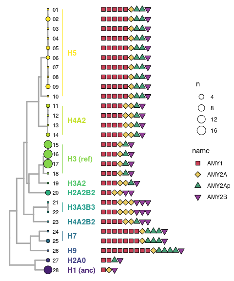
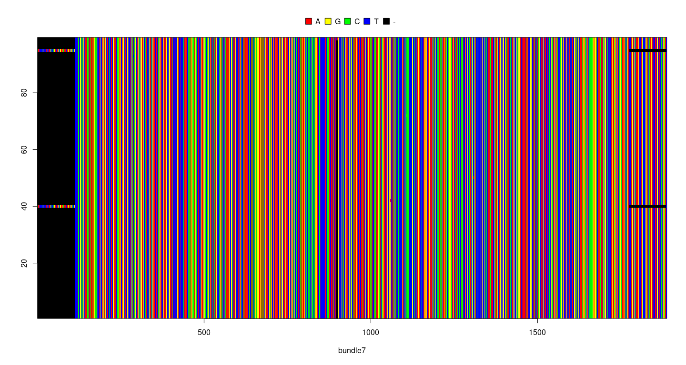
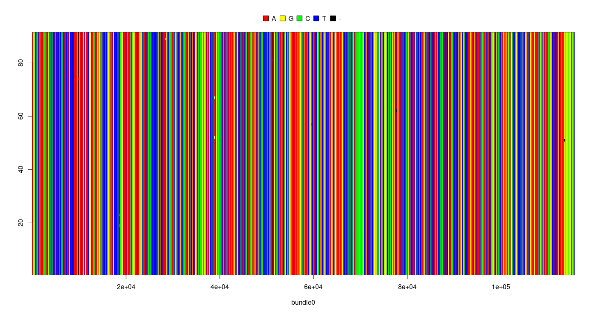
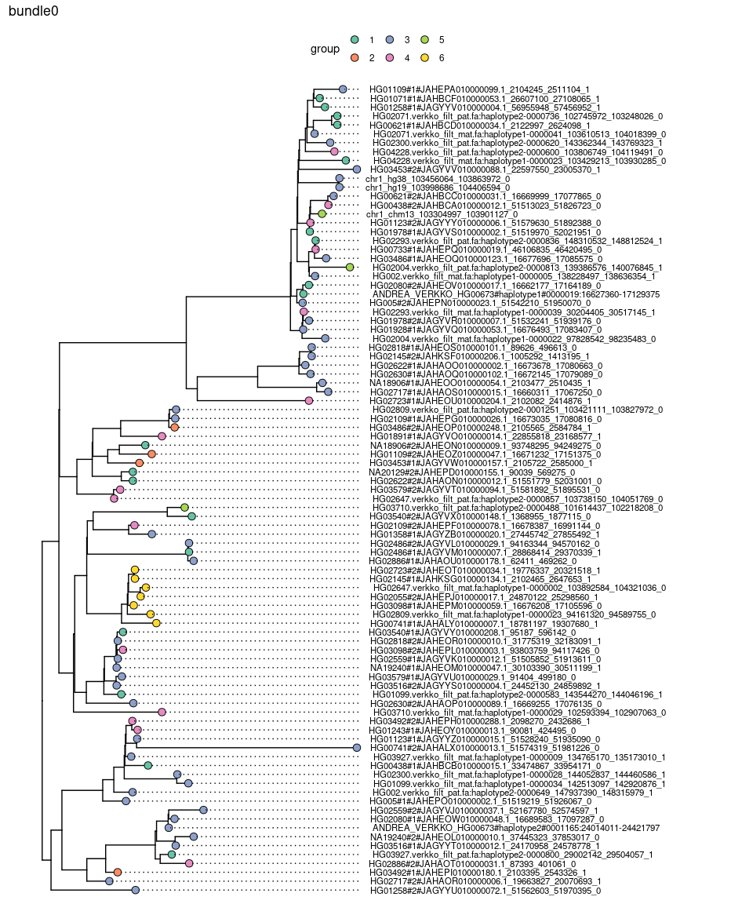
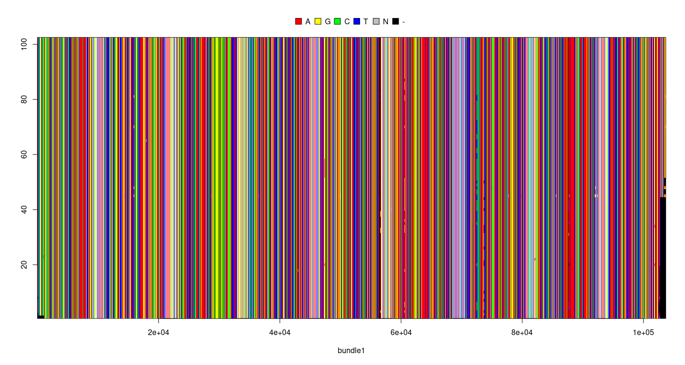
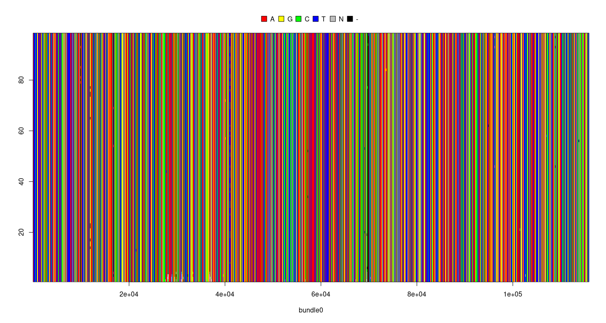
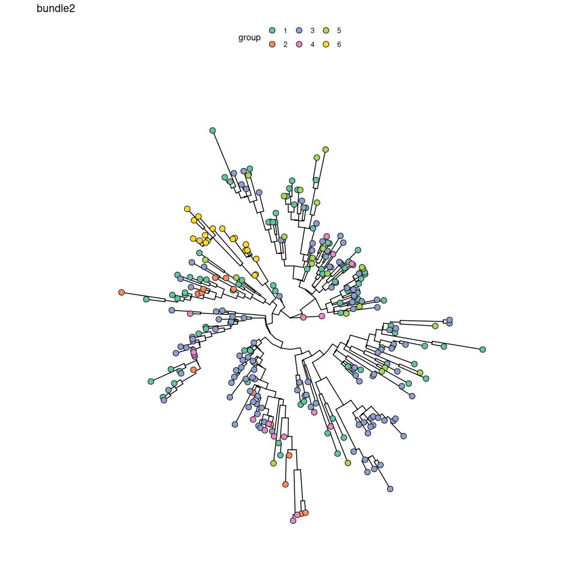
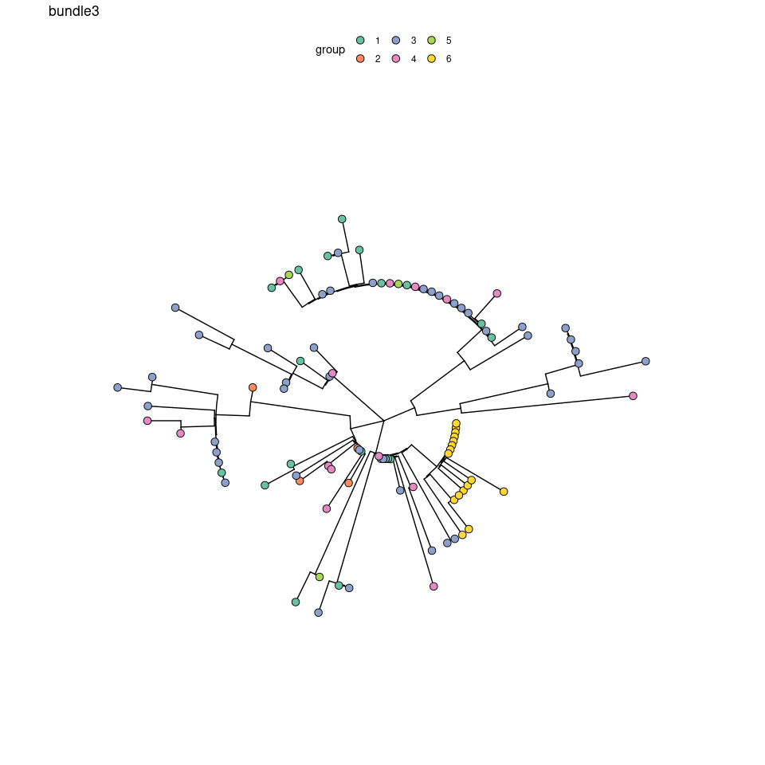
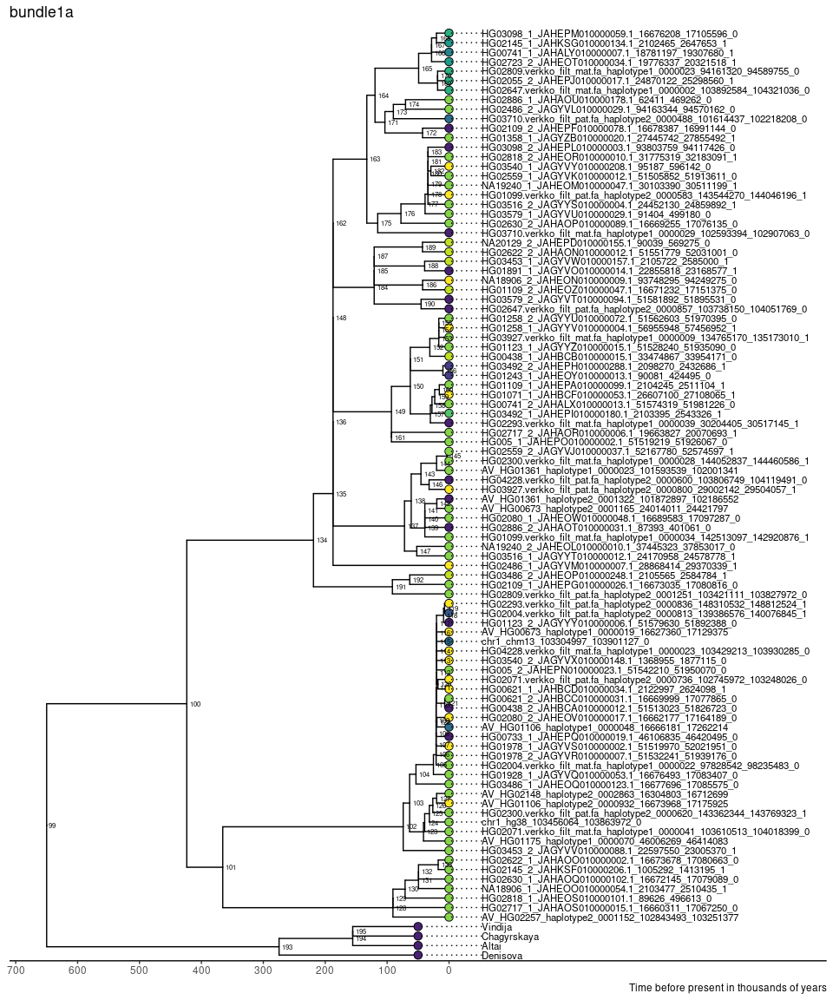
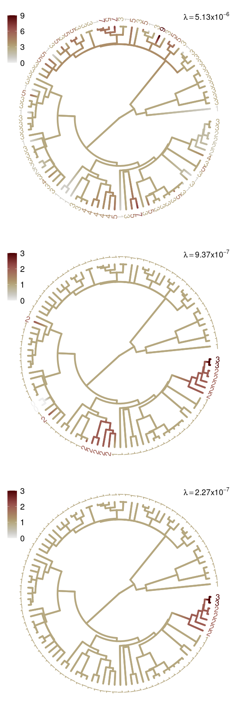

Examination of bundle sequences
================

``` r
library(tidyverse)
library(ggtree)
library(treeio)
library(caper)
library(tidytree)
library(pegas)
```

## Structure tree

``` r
hap_struc_table <- read_tsv("../combined_y1_y2_analyses/output/haplotype_all_structures.tsv") 

structure_tree <- read.newick("../combined_y1_y2_analyses/output/haplotype_structures_tree.nwk")

structure_tree_grouped <- structure_tree %>%
  as_tibble() %>%
  left_join(count(hap_struc_table, hap_struc_d), by=c("label"="hap_struc_d")) %>%
  groupClade(c(43, 40, 55, 59, 36, 32)) %>%
  mutate(group = as.character(group))
hap_group_table <- structure_tree_grouped %>% 
  dplyr::select(label, group) %>% 
  filter(!is.na(label))
group_color <- RColorBrewer::brewer.pal(6, "Set1")
structure_ggtree <-  structure_tree_grouped %>%
  as.treedata() %>%
  ggtree(aes(color=group), linewidth=1) +
  scale_color_manual(values = c("black",group_color)) +
  geom_tiplab(align=TRUE, mapping = aes(label=label), size=3, offset = 0.03, color="black") +
  geom_tippoint(aes(size=n, fill=group), shape=21, color="black") +
  scale_fill_manual(values = group_color) +
  #geom_text2(aes(subset=!isTip, label=node), hjust=-.3, size=2) +
  xlim_tree(1.2)
structure_ggtree
```

<!-- -->

## Extract all AMY genes from the fasta file

``` r
bundle_loc <- read_tsv("../combined_y1_y2_analyses/output/pgrtk/AMY_48_56_4_1000.bed", col_names = c("chrom", "start", "end", "tmp"), skip=1) %>%
  separate(tmp, into = c("name", "tmp1", "strand", "tmp2"), extra = "merge") %>%
  dplyr::select(-tmp1, -tmp2) %>%
  mutate(length=end-start) %>%
  group_by(name) %>%
  mutate(mean_length=mean(length), sd_length=sd(length)) %>%
  ungroup()

bundle_loc %>%
  ggplot()+
  geom_histogram(aes(x=length/1000, fill=length <= mean_length - 3* sd_length)) +
  facet_wrap(~name, scales = "free") +
  cowplot::theme_cowplot() +
  theme(legend.position = 'none')
```

<!-- -->

``` r
bundle_loc_filtered <-  bundle_loc %>%
  filter(length > mean_length - 3* sd_length) 

bundle_loc_filtered %>%
  count(chrom, name) %>%
  count(name, n) %>%
  pivot_wider(names_from=n, values_from = nn) %>%
  rename(bundle_name = name)
```

    ## # A tibble: 9 × 8
    ##   bundle_name   `1`   `2`   `3`   `4`   `5`   `7`   `9`
    ##   <chr>       <int> <int> <int> <int> <int> <int> <int>
    ## 1 0              89    NA    NA    NA    NA    NA    NA
    ## 2 1              88    NA    NA    NA    NA    NA    NA
    ## 3 2              13     6    46     7    14     2     1
    ## 4 3              80     5     2    NA    NA    NA    NA
    ## 5 4              16    42    24     1     5     1    NA
    ## 6 5              15    47    24     2     1    NA    NA
    ## 7 6              18    47    21     1     1    NA    NA
    ## 8 7              75     9     2    NA    NA    NA    NA
    ## 9 8              19    48    20     1     1    NA    NA

``` r
bundle_loc_filtered %>%
  group_by(name) %>%
  summarise(n=n(), mean_length=mean(length)) %>%
  rename(bundle_name = name)
```

    ## # A tibble: 9 × 3
    ##   bundle_name     n mean_length
    ##   <chr>       <int>       <dbl>
    ## 1 0              89     115358.
    ## 2 1              88     102749.
    ## 3 2             284      32021.
    ## 4 3              96      22833.
    ## 5 4             208      14630.
    ## 6 5             194      12460.
    ## 7 6             184       2039 
    ## 8 7              99       1770.
    ## 9 8             184       1311.

``` r
bundle_loc_filtered %>%
  dplyr::select(chrom, start, end, name, strand) %>%
  write_tsv("bundle_locations_on_haplotypes_filtered.tsv")
```

These confirm that `tname` =`contig` = `chrom`, `tstart`=`start`,
`tend=end`, and the combination of `chrome`, `start`, and `end` are
unique for each gene.

There are a total of 89 chromosomes, matching the fasta file. I had to
subset the sequence to 10000bp if they are longer because MUSCLE cannot
handle longer sequences. I’ll need to explore other tools or mapping to
a reference

``` bash
cd /global/scratch/users/nicolas931010/amylase_diversity_project/HPRC_AMY_Sequences/bundle_tree
rm fasta/*
SEQ=../amy_tree/AMY1A_region_seq.fa
BUNDLE_LOC=bundle_locations_on_haplotypes_filtered.tsv
NLINE=`wc -l $BUNDLE_LOC | cut -f 1 -d ' '`
for I in `seq 2 $NLINE`; do
CHRM=`awk -v i=$I '{if(NR==i) print $1}' $BUNDLE_LOC`
START=`awk -v i=$I '{if(NR==i) print $2}' $BUNDLE_LOC`
END=`awk -v i=$I '{if(NR==i) print $3}' $BUNDLE_LOC`
BUNDLE=`awk -v i=$I '{if(NR==i) print $4}' $BUNDLE_LOC`
STRAND=`awk -v i=$I '{if(NR==i) print $5}' $BUNDLE_LOC`
OUT=fasta/bundle${BUNDLE}.fa
NAME=${CHRM}.${START}_${END}
echo '>'${NAME} >> ${OUT}
if [ $STRAND = 0 ]; then
echo 0
grep -A 1 ${CHRM} ${SEQ} | tail -n 1 | cut -c ${START}-${END} >> ${OUT}
else
echo 1
grep -A 1 ${CHRM} ${SEQ} | tail -n 1 | cut -c ${START}-${END} | tr ACGTacgt TGCAtgca | rev >> ${OUT}
fi
done
```

## Multiple sequence alignment and tree construction (kalign3)

``` bash
## Set up kalign and iqtree
conda activate base
mamba create -c bioconda -n kalign3 kalign3 iqtree
## Run kalign and iqtree
for BUNDLE in {0..8}; do
echo '#!/bin/bash
source ~/.bashrc
conda activate kalign3
cat fasta/bundle'${BUNDLE}'.fa | kalign -o kalign/bundle'${BUNDLE}'.afa &> kalign/bundle'${BUNDLE}'.log
iqtree -s kalign/bundle'${BUNDLE}'.afa --prefix iqtree/bundle'${BUNDLE}' -nt 10' | \
sbatch \
--time=4320 \
--nodes=1 \
--cpus-per-task=10 \
--account=co_genomicdata \
--partition=savio3_htc \
--qos=savio_lowprio \
--output=logs/kalign/bundle${BUNDLE}-%j.log
done

#cat fasta/bundle'${BUNDLE}'.fa | kalign --type dna --nthreads 20 -f fasta > kalign/bundle'${BUNDLE}'.afa
```

## Tree visualization

``` r
bundle_count_by_contig <- bundle_loc %>%
  group_by(chrom, name) %>%
  summarise(copy_number=n()) %>%
  pivot_wider(names_from = name, values_from = copy_number, values_fill=0, names_prefix = "copy_number_") %>%
  transmute(chrom = chrom, haplotype = str_c(copy_number_2, copy_number_3, copy_number_4, copy_number_5, copy_number_6))

bundle_info <- bundle_loc_filtered %>%
  transmute(chrom=chrom, start=start, end=end, name=name, 
            label=str_c(chrom, ".", start, "_", end) %>% str_replace_all("#", "_") %>% str_replace_all(":", "_"))
read_fasta <- function(x, range=NA){
  if (any(is.na(range))){
    dna <- read.dna(x, format = "fasta") 
  } else {
    dna <- read.dna(x, format = "fasta") %>% 
      .[,range]
  }
  return(dna)
}
nj_tree <- function(x, pairwise.deletion = TRUE){
  x %>%
    dist.dna(pairwise.deletion = TRUE) %>%
    nj() 
}
combine_tree_data <- function(x) {
  x %>%
    phytools::midpoint.root() %>%
    as_tibble() %>%
    mutate(label = str_replace_all(label, "#", "_") %>% str_replace_all(":", "_")) %>%
    left_join(bundle_info, by="label") %>%
    left_join(hap_struc_table, by = c("chrom" = "contig")) %>%
    left_join(hap_group_table, by=c("hap_struc_d" = "label")) %>%
    as.treedata() 
}
plot_tree <- function(x, type, title){
  x %>%
    ggtree(layout=type) +
    geom_tippoint(mapping = aes(fill=group), size=3, color="black", shape = 21) +
    scale_fill_manual(values = group_color) +
    ggnewscale::new_scale_fill() +
    ggtitle(title) +
    theme_tree() +
    theme(legend.position = "top")
}
opposing_trees <- function(p1, p2, join_line_by){
  d1 <- p1$data
  d2 <- p2$data
  ## reverse x-axis and 
  ## set offset to make the tree on the right-hand side of the first tree
  d2$x <- max(d2$x) - d2$x + max(d1$x) + 0.0001
  pp <- p1 + 
    geom_tree(data=d2, layout='rectangular') +
    geom_text2(data=d2, aes(subset=!isTip, label=node), hjust=-.3, size=2) +
    geom_tippoint(data=d2, mapping = aes(fill=group), size=3, color="black", shape = 21)
  dd <- bind_rows(d1, d2) %>% 
    filter(!is.na(label))
  pp + 
    geom_line(aes(x, y, group={{join_line_by}}, color=group), data=dd, size = 0.2) +
    scale_color_manual(values = group_color) +
    scale_fill_manual(values = group_color)
}
```

#### All alignments

<details>
<summary>
Show figures
</summary>

``` r
for (i in 0:8){
  dna <- read_fasta(str_c("kalign/bundle",i, ".afa"))
  #spider::checkDNA(dna) %>%
  #  as.vector() %>%
  #  hist()
  seq_order <- spider::checkDNA(dna[,]) %>%
    as.vector() %>%
    order()
  ape::image.DNAbin(dna[seq_order,], show.labels = FALSE, xlab = str_c("bundle", i))
}
```

<!-- --><!-- --><!-- --><!-- --><!-- --><!-- --><!-- --><!-- --><!-- -->

</details>

#### Rectangular

Bundle 0 as an example

``` r
bundle0_tree <- str_c("iqtree/bundle", 0, ".treefile") %>%
  read.tree() %>%
  combine_tree_data() %>%
  plot_tree("rectangular", "bundle0")
bundle0_tree +
  geom_tiplab(aes(label=chrom), align = TRUE, size = 3, hjust = -0.05) +
  xlim_tree(0.001)
```

<!-- -->

``` r
dna <- read_fasta(str_c("kalign/bundle",0, ".afa"))
missing_data_location <- dna %>% as.character() %>% apply(2, function(x){sum(x=="-")}) %>% magrittr::divide_by(dim(dna)[1]) %>% magrittr::is_greater_than(0.1) %>% which()
common_snp_location <- dna[,] %>% as.character() %>% apply(2, function(x){table(x) %>% sort(decreasing = TRUE) %>% .[1] %>% magrittr::divide_by(length(x))}) %>% magrittr::is_less_than(0.9) %>% which()
common_snp <- dna[, setdiff(common_snp_location, missing_data_location)]
common_snp <- updateLabel(common_snp, labels(common_snp), labels(common_snp) %>% str_replace_all("#", "_") %>% str_replace_all(":", "_"))
msaplot(bundle0_tree, common_snp, offset=0.0001, width=3, window = NULL, color = c("red", "yellow", "green", "blue"), bg_line=FALSE, height=1)
```

<!-- -->

#### Circular

<details>
<summary>
Show figures
</summary>

``` r
for (i in 0:5){
  circular_tree <- str_c("iqtree/bundle", i, ".treefile") %>%
    read.tree() %>%
    combine_tree_data() %>%
    plot_tree("circular", str_c("bundle", i))
  print(circular_tree)
}
```

<!-- --><!-- --><!-- --><!-- --><!-- --><!-- -->

</details>

#### Neighbor-joining tree based on the distance matrix

<details>
<summary>
Show figures
</summary>

``` r
for (i in 0:5){
  circular_tree <- str_c("kalign/bundle", i, ".afa") %>%
    read_fasta() %>%
    nj_tree(FALSE) %>%
    combine_tree_data() %>%
    plot_tree("equal_angle", str_c("bundle", i))
  print(circular_tree)
}
```

<!-- --><!-- --><!-- --><!-- --><!-- --><!-- -->

</details>

#### IQTree vs. Neighbor-joining

``` r
p1 <- str_c("iqtree/bundle", 0, ".treefile") %>%
  read.tree() %>%
  combine_tree_data() %>%
  plot_tree("rectangular", str_c("bundle", 0, ": iqtree vs. neighbor-joining")) +
  geom_text2(aes(subset=!isTip, label=node), hjust=-.3, size=2)
p2 <- str_c("kalign/bundle", 0, ".afa") %>%
  read_fasta() %>%
  nj_tree() %>%
  combine_tree_data() %>%
  ggtree()
opposing_trees(p1 %>% ggtree::rotate(160) %>% ggtree::rotate(161), p2 %>% ggtree::rotate(91) %>% ggtree::rotate(92), label)
```

    ## Warning: Using `size` aesthetic for lines was deprecated in ggplot2 3.4.0.
    ## ℹ Please use `linewidth` instead.

<!-- -->

#### Trees in sliding windows in bundle 1

``` r
bundle1_window1 <- str_c("kalign/bundle", 1, ".afa") %>%
  read_fasta(00001:20000) %>%
  nj_tree() %>%
  combine_tree_data() %>%
  plot_tree("rectangular", str_c("bundle", 1, "(1:20000)")) +
  geom_text2(aes(subset=!isTip, label=node), hjust=-.3, size=2)
bundle1_window2 <- str_c("kalign/bundle", 1, ".afa") %>%
  read_fasta(20001:40000) %>%
  nj_tree() %>%
  combine_tree_data() %>%
  ggtree()
bundle1_window3 <- str_c("kalign/bundle", 1, ".afa") %>%
  read_fasta(40001:60000) %>%
  nj_tree() %>%
  combine_tree_data() %>%
  ggtree()
bundle1_window5 <- str_c("kalign/bundle", 1, ".afa") %>%
  read_fasta(80001:100000) %>%
  nj_tree() %>%
  combine_tree_data() %>%
  ggtree()+
  geom_text2(aes(subset=!isTip, label=node), hjust=-.3, size=2)

opposing_trees(bundle1_window1 %>% ggtree::rotate(128), bundle1_window2 %>% ggtree::rotate(91) %>% ggtree::rotate(107), label)
```

<!-- -->

``` r
opposing_trees(bundle1_window1, bundle1_window5 %>% ggtree::rotate(89), label)
```

<!-- -->

#### Bundle 0 vs. 1

``` r
p1 <- str_c("kalign/bundle", 0, ".afa") %>%
  read_fasta(60001:100000) %>%
  nj_tree() %>%
  combine_tree_data() %>%
  plot_tree("rectangular", str_c("bundle", 0, "(60001:80000)")) +
  geom_text2(aes(subset=!isTip, label=node), hjust=-.3, size=2)
p2 <- str_c("kalign/bundle", 1, ".afa") %>%
  read_fasta(00001:40000) %>%
  nj_tree() %>%
  combine_tree_data() %>%
  ggtree() 

opposing_trees(p1 %>% ggtree::rotate(91) %>% ggtree::rotate(100) %>% ggtree::rotate(126), 
               p2 %>% ggtree::rotate(90) %>% ggtree::rotate(91) %>% ggtree::rotate(92) %>% ggtree::rotate(154), 
               chrom)
```

<!-- -->

#### Trees in sliding windows in bundle 2

``` r
bundle2_window1 <- str_c("kalign/bundle", 2, ".afa") %>%
  read_fasta(8000:18000) %>%
  nj_tree() %>%
  combine_tree_data() %>%
  plot_tree("rectangular", str_c("bundle", 2, "(1:10000)")) +
  geom_text2(aes(subset=!isTip, label=node), hjust=-.3, size=2)
bundle2_window2 <- str_c("kalign/bundle", 2, ".afa") %>%
  read_fasta(18000:28000) %>%
  nj_tree() %>%
  combine_tree_data() %>%
  ggtree()
opposing_trees(bundle2_window1 %>% ggtree::rotate(307), bundle2_window2 %>% ggtree::rotate(285) %>% ggtree::rotate(369), label)
```

<!-- -->

## Diversity

``` r
nuc_div_in_windows <- function(dna, window_size, length_to_trim){
  ## Trim the beginning and the end
  length <- dim(dna)[2]
  dna <- dna[, -c(0:length_to_trim, (length-length_to_trim+1):(length+1))]
  length <- dim(dna)[2]
  n_windows <- (length/window_size) %>% ceiling()
  windows <- lapply(0:(n_windows-2), function(x){c(1+x*window_size, window_size+x*window_size)}) 
  windows[[n_windows]]  <- c(1+(n_windows-1)*window_size, length)
  pos <- lapply(windows, mean) %>%
    unlist() %>%
    floor() %>%
    magrittr::add(length_to_trim)
  size <- lapply(windows, function(x){x[2]-x[1]}) %>%
    unlist()
  lapply(windows, function(x){dna[,x[1]:x[2]]}) %>%
    lapply(function(x){nuc.div(x, pairwise.deletion = FALSE)}) %>%
    unlist() %>%
    tibble(pos=pos, size=size, nuc_div=.)
}
nuc_div_table <- NULL
for(i in as.character(0:5)){
  nuc_div_table_tmp <- read_fasta(str_c("kalign/bundle", i, ".afa")) %>%
    nuc_div_in_windows(5000, 500) %>%
    mutate(bundle=i)
  nuc_div_table <- bind_rows(nuc_div_table, nuc_div_table_tmp)
}
nuc_div_table  %>%
  ggplot(aes(x=pos, y=nuc_div)) +
  geom_line() +
  geom_point() +
  facet_wrap(~bundle, scales = "free_x")
```

    ## Warning: Removed 3 rows containing missing values (`geom_point()`).

<!-- -->
