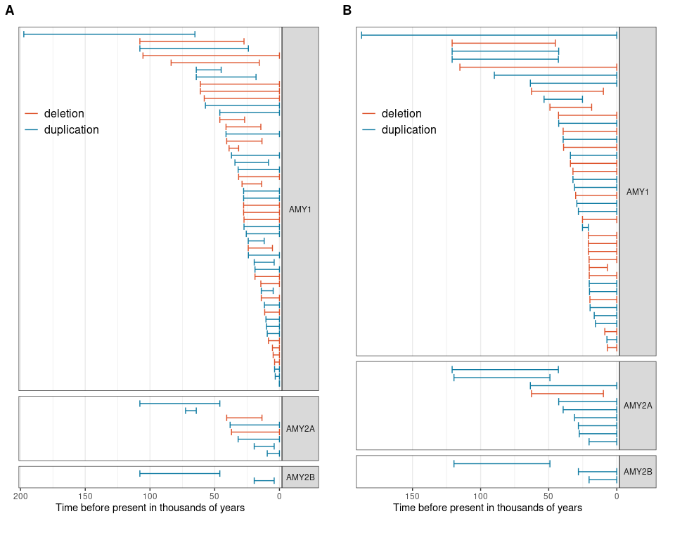

Ancestral state reconstruction using cafe
================

``` r
library(tidyverse)
library(ggtree)
library(treeio)
# library(caper)
# library(tidytree)
# library(pegas)
# library(phytools)
library(cowplot)
```

#### Ancestral state reconstruction with cafe5

``` r
for (bundle in c("0", "1a")){
  bundle_treedata <-str_c("iqtree/bundle", bundle, "_with_outgroup.timetree.nex") %>%
    read.nexus() %>%
    treeio::drop.tip(tip = c("Altai","Chagyrskaya", "Denisova", "Vindija")) %>%
    combine_tree_data()
  #tips_to_drop <- bundle_treedata %>% as_tibble() %>% filter(!is.na(label)) %>% pull(label) %>% sample(50)
  rescaled_tree <- bundle_treedata %>%
    #treeio::drop.tip(tip=tips_to_drop) %>% 
    as_tibble() %>%
    mutate(branch.length=branch.length/1000)
  rescaled_tree %>%
    as.phylo() %>%
    write.tree(str_c("cafe/bundle", bundle, ".nwk"))
  cafe_table <- rescaled_tree %>%
    as_tibble() %>%
    dplyr::select(label, AMY1, AMY2A, AMY2B) %>%
    filter(!is.na(label)) %>%
    pivot_longer(cols = 2:4, names_to = "ID", values_to = "n") %>%
    pivot_wider(names_from = label, values_from = n, values_fill = 0) %>%
    mutate(DESCRIPTION=ID) %>%
    relocate(DESCRIPTION, ID) 
  cafe_table %>%
    write_tsv(str_c("cafe/bundle", bundle, "_copy_number.tsv"), col_names = TRUE)
  cafe_table %>%
    group_by(DESCRIPTION, ID) %>%
    group_walk(~write_tsv(.x, str_c("cafe/bundle", bundle, "_", .y$ID, "_copy_number.tsv")), .keep = TRUE)
}
```

All amy genes together

``` bash
#mamba create -c bioconda -c conda-forge -n cafe cafe
conda activate cafe
cd /global/scratch/users/nicolas931010/amylase_diversity_project/HPRC_AMY_Sequences/bundle_tree/
#mkdir -p cafe
for RUN in {1..5}; do
for BUNDLE in 0 1a; do
echo '#!/bin/bash
source ~/.bashrc
conda activate cafe
cd /global/scratch/users/nicolas931010/amylase_diversity_project/HPRC_AMY_Sequences/bundle_tree/
cafe5 --infile cafe/bundle'${BUNDLE}'_copy_number.tsv --tree cafe/bundle'${BUNDLE}'.nwk -k 3 --cores 20 -o cafe/bundle'${BUNDLE}'_results_run'${RUN} | \
sbatch \
--time=4320 \
--nodes=1 \
--cpus-per-task=20 \
--account=co_genomicdata \
--partition=savio4_htc \
--qos=savio_lowprio \
--output=cafe/bundle${BUNDLE}_run${RUN}.log
done
done
```

each gene separately

``` bash
for BUNDLE in 0 1a; do
for GENE in AMY1 AMY2A AMY2B; do
echo '#!/bin/bash
source ~/.bashrc
conda activate cafe
cd /global/scratch/users/nicolas931010/amylase_diversity_project/HPRC_AMY_Sequences/bundle_tree/
cafe5 --infile cafe/bundle'${BUNDLE}'_'${GENE}'_copy_number.tsv --tree cafe/bundle'${BUNDLE}'.nwk --cores 20 -o cafe/bundle'${BUNDLE}'_'${GENE}'_results' | \
sbatch \
--time=4320 \
--nodes=1 \
--cpus-per-task=20 \
--account=co_genomicdata \
--partition=savio4_htc \
--qos=savio_lowprio \
--output=cafe/bundle${BUNDLE}_${GENE}.log
done
done
```

estimated gene expansion rate

``` r
lambda_table_separate <- NULL
change_table <- NULL
for (bundle in c("0", "1a")){
  for (gene in c("AMY1", "AMY2A", "AMY2B")){
    df <- read_tsv(str_c("../bundle_tree/cafe/bundle", bundle, "_", gene, "_results/Base_results.txt"), col_names = FALSE) %>%
      separate(X1, c("name", "value"), sep = ":", fill = "right") %>%
      ## scale back by dividing by 1000, and multiply by 30 so we get per generation rate 
      mutate(value=parse_double(value)/1000*30)
    lambda_table_separate_tmp <- tibble(bundle=bundle, gene=gene, lambda=df[[2, 2]], likelihood=df[[1,2]])
    lambda_table_separate <- bind_rows(lambda_table_separate, lambda_table_separate_tmp)
    change_table_tmp <- read_lines(str_c("../bundle_tree/cafe/bundle", bundle, "_", gene, "_results/Base_change.tab"), skip = 1) %>%
      str_split("\t") %>%
      .[[1]] %>%
      .[-1] %>%
      tibble(x=.) %>%
      count(x) %>%
      mutate(bundle=bundle, gene=gene)
    change_table <- bind_rows(change_table, change_table_tmp)
  }
}
lambda_table_separate %>%
  dplyr::select(-likelihood) %>%
  pivot_wider(names_from = gene, values_from = lambda)
```

    ## # A tibble: 2 × 4
    ##   bundle     AMY1     AMY2A      AMY2B
    ##   <chr>     <dbl>     <dbl>      <dbl>
    ## 1 0      0.000209 0.0000307 0.00000736
    ## 2 1a     0.000103 0.0000263 0.00000741

``` r
change_table %>%
  arrange(x) %>%
  pivot_wider(names_from = "x", values_from = "n") %>%
  arrange(bundle, gene)
```

    ## # A tibble: 6 × 10
    ##   bundle gene   `+0`  `+1`  `+2`  `+4`  `+5`  `-1`  `-2`  `-4`
    ##   <chr>  <chr> <int> <int> <int> <int> <int> <int> <int> <int>
    ## 1 0      AMY1    137    15    10    NA     1    13    10     1
    ## 2 0      AMY2A   179     6    NA    NA    NA     2    NA    NA
    ## 3 0      AMY2B   185     2    NA    NA    NA    NA    NA    NA
    ## 4 1a     AMY1    147     9     9     2    NA     4    14     2
    ## 5 1a     AMY2A   177     9    NA    NA    NA     1    NA    NA
    ## 6 1a     AMY2B   184     3    NA    NA    NA    NA    NA    NA

``` r
lambda_table_combined <- NULL
for (bundle in c("0", "1a")){
  for (run in 1:5){
    df <- read_tsv(str_c("../bundle_tree/cafe/bundle", bundle, "_results_run", run, "/Gamma_results.txt"), col_names = FALSE) %>%
      separate(X1, c("name", "value"), sep = ":", fill = "right") %>%
      ## scale back by dividing by 1000, and multiply by 30 so we get per generation rate 
      mutate(value=parse_double(value)/1000*30)
    alpha <- read_tsv(str_c("../bundle_tree/cafe/bundle", bundle, "_results_run", run, "/Gamma_family_likelihoods.txt"), col_names = FALSE, skip = 1) %>%
      group_by(X1) %>%
      slice_max(X5) %>%
      ungroup() %>%
      transmute(gene=X1, lambda=X2*df[[2, 2]])
    lambda_table_combined_tmp <- alpha %>%
      mutate(bundle=bundle, run=run, likelihood=df[[1,2]])
    lambda_table_combined <- bind_rows(lambda_table_combined, lambda_table_combined_tmp)
  }
}
lambda_table_combined %>%
  pivot_wider(names_from = gene, values_from = lambda) %>%
  arrange(bundle, likelihood)
```

    ## # A tibble: 10 × 6
    ##    bundle   run likelihood     AMY1     AMY2A      AMY2B
    ##    <chr>  <int>      <dbl>    <dbl>     <dbl>      <dbl>
    ##  1 0          1       8.11 0.000209 0.0000448 0.00000348
    ##  2 0          3       8.11 0.000209 0.0000449 0.00000350
    ##  3 0          5       8.11 0.000209 0.0000449 0.00000349
    ##  4 0          2       8.11 0.000209 0.0000482 0.00000440
    ##  5 0          4       8.13 0.000209 0.0000183 0.0000183 
    ##  6 1a         3       8.20 0.000103 0.0000322 0.00000562
    ##  7 1a         4       8.20 0.000103 0.0000323 0.00000564
    ##  8 1a         1       8.20 0.000103 0.0000284 0.00000380
    ##  9 1a         5       8.21 0.000103 0.0000369 0.00000841
    ## 10 1a         2       8.26 0.000103 0.0000137 0.0000137

Ancestral state reconstruction visualization

``` r
expSup <- function(w, digits=0) {
  sprintf(paste0("%.", digits, "f*x*10^%d"), w/10^floor(log10(abs(w))), floor(log10(abs(w))))
}

for (bundle in c("0", "1a")){
  for (gene in c("AMY1", "AMY2A", "AMY2B")){
    if(gene=="AMY1"){copy_number_break <-c(0,3,6,9)} else {copy_number_break <- c(0,1,2,3)}
    lambda <- read_tsv(str_c("../bundle_tree/cafe/bundle", bundle, "_", gene, "_results/Base_results.txt"), col_names = FALSE, show_col_types = FALSE) %>%
      separate(X1, c("name", "value"), sep = ":", fill = "right") %>%
      mutate(value=parse_double(value)/1000*30) %>%
      .[[2,2]]
    time_to_root <- str_c("cafe/bundle", bundle, "_", gene, "_results/Base_asr.tre") %>%
      read.nexus() %>% 
      castor::get_all_distances_to_root() 
    tree <- str_c("cafe/bundle", bundle, "_", gene, "_results/Base_asr.tre") %>%
      read.nexus() %>%
      as.treedata() %>%
      mutate(trait=str_extract(label, "(\\d+)$") %>% as.integer(), time_to_present=time_to_root-max(time_to_root))
    amy_ace_tree <- ggtree(tree, aes(color = trait), 
           layout = 'circular', 
           ladderize = TRUE, continuous = "color", size = 1.5) +
      geom_tiplab(aes(label=trait), hjust = -1, size = 5) +
      scico::scale_color_scico(palette = "bilbao", name = gene, begin = 0.05, limits=c(0, NA), midpoint = NA, direction = 1, breaks=copy_number_break, labels=copy_number_break) + 
      annotate(geom = "text", x=Inf, y=9, hjust = 0.33, vjust = -4.8, size = 6, label = parse(text=str_c("lambda == ", expSup(lambda, 2)))) +
      annotate(geom = "text", x=Inf, y=8.7, hjust = 0.33, vjust = -5.5, size = 6, label = "per generation") +
      theme(
        legend.position = c(0.05, 0.85),
        legend.text = element_text(size = 15),
        legend.title = element_blank())
    assign(str_c("p_", bundle, "_", gene), amy_ace_tree)
    #ggsave(str_c("figures/bundle", bundle, "_", gene, "_ace_tree.pdf"), amy_ace_tree, width = 6, height = 6)
    amy_in_time <- tree %>%
      as_tibble() %>%
      ggplot(aes(x=time_to_present, y=trait)) +
      geom_point()+
      # geom_smooth(aes(color=(time_to_present>-10)), method="lm", se = FALSE) +
      # geom_vline(xintercept = -10) +
      geom_smooth(method="lm") +
      theme_cowplot() +
      theme(panel.border = element_rect(color="black", linewidth = 0.5))
    assign(str_c("time_", bundle, "_", gene), amy_in_time)
    lm(trait~time_to_present, tree%>%as_tibble) %>% summary() %>% .$coefficients %>% knitr::kable()
  }
}
amy_ace_plot_bundle0 <- plot_grid(p_0_AMY1, p_0_AMY2A, p_0_AMY2B, ncol = 1)
amy_ace_plot_bundle1a <- plot_grid(p_1a_AMY1, p_1a_AMY2A, p_1a_AMY2B, ncol = 1)
amy_ace_plot_bundle0
```

<!-- -->

``` r
amy_ace_plot_bundle1a
```

<!-- -->

``` r
time_plot_bundle0 <- plot_grid(time_0_AMY1, time_0_AMY2A, time_0_AMY2B, ncol = 1)
time_plot_bundle1a <- plot_grid(time_1a_AMY1, time_1a_AMY2A, time_1a_AMY2B, ncol = 1)
time_plot_bundle0
```

<!-- -->

``` r
time_plot_bundle1a
```

<!-- -->

``` r
ggsave("figures/bundle0_ace_tree.pdf", amy_ace_plot_bundle0, width = 6, height = 18)
ggsave("figures/bundle1a_ace_tree.pdf", amy_ace_plot_bundle1a, width = 6, height = 18)
```

``` r
# bundle <- "0"
# gene <- "AMY1"
for (bundle_id in c("0", "1a")){
  time_combined <- NULL
  for (gene in c("AMY1", "AMY2A", "AMY2B")){
    tree_data <- str_c("cafe/bundle", bundle_id, "_", gene, "_results/Base_asr.tre") %>%
      read.nexus() %>%
      ggtree() %>%
      .$data %>%
      as_tibble() %>%
      mutate(label=str_replace(label, ">.*$", ">"),
             x=x-max(x))
    change <- read_tsv(str_c("cafe/bundle", bundle_id, "_", gene, "_results/Base_clade_results.txt")) %>%
      rename("Taxon_ID"="#Taxon_ID") %>%
      janitor::clean_names() %>%
      mutate(type=ifelse(increase>decrease, "duplication", "deletion")) %>%
      dplyr::select(taxon_id, type)
    time_lower_bound  <- change %>%
      left_join(tree_data, by=c("taxon_id"="label")) %>%
      dplyr::select(taxon_id, type, x)
    time_upper_bound <- change %>%
      left_join(tree_data, by=c("taxon_id"="label")) %>%
      dplyr::select(taxon_id, type, parent) %>%
      left_join(tree_data, by=c("parent"="node")) %>%
      dplyr::transmute(taxon_id, type, xend=x)
    time_combined_tmp <- time_lower_bound %>%
      left_join(time_upper_bound, by = join_by(taxon_id, type)) %>%
      arrange(-xend) %>%
      mutate(index=row_number(),
             bundle=bundle_id, gene=gene)
    time_combined <- bind_rows(time_combined, time_combined_tmp)
  }
  time_combined_plot_tmp <- time_combined %>%
  mutate(type=fct_relevel(type, c("deletion", "duplication"))) %>%
  filter(bundle==bundle_id) %>%
  ggplot(aes(xmin=x, xmax=xend, color=type, y=index)) +
  geom_errorbar() +
  scale_color_manual(values=MetBrewer::met.brewer(name="Egypt", type = "discrete")) +
  facet_grid(gene~., scales = "free_y", space = "free_y") +
  theme_bw() +
  scale_x_continuous(breaks = -(0:4)*50, labels = (0:4)*50, limits = c(NA, 0), expand = expansion(add=c(4,2))) +
  scale_y_discrete() +
  labs(x="Time before present in thousands of years") +
  theme(panel.grid.major.y = element_blank(),
        panel.grid.minor.y = element_blank(),
        axis.title.y = element_blank(),
        axis.ticks.y = element_blank(),
        axis.text.y = element_blank(),
        strip.text.y = element_text(angle=0),
        legend.position = c(0.16, 0.8),
        legend.title = element_blank(),
        legend.text = element_text(size=12),
        legend.background = element_rect(fill = "transparent", color = NULL))
  assign(str_c("time_combined_plot_", bundle_id), time_combined_plot_tmp)
}
time_combined_plot <- plot_grid(time_combined_plot_0, time_combined_plot_1a, labels = c("A", "B"), scale = 0.92, nrow = 1)
time_combined_plot
```

<!-- -->

``` r
ggsave(filename = "figures/mutation_time_estimates.pdf", plot = time_combined_plot, width = 10, height = 8, units = "in")
ggsave(filename = "figures/mutation_time_estimates.png", plot = time_combined_plot, width = 10, height = 8, units = "in")
```
