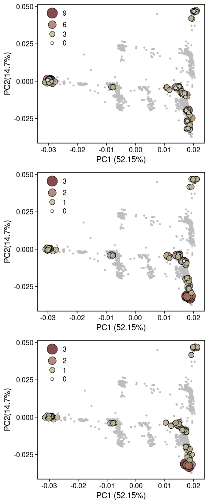

PCA
================

``` r
library(tidyverse)
library(cowplot)
```

## Export bundle 0 and 1 sequences in fasta format for each haplotype individually

``` bash
cd /global/scratch/users/nicolas931010/amylase_diversity_project/HPRC_AMY_Sequences/snp_calling
#gunzip -c ../combined_y1_y2_analyses/input/combined_input/AMY1A_region_seq.fa.gz > AMY1A_region_seq.fa
SEQ=../bundle_tree/AMY1A_region_seq.fa
BUNDLE_LOC=../bundle_tree/bundle_locations_on_haplotypes_filtered.tsv
NLINE=`wc -l $BUNDLE_LOC | cut -f 1 -d ' '`
for I in `seq 2 $NLINE`; do
CHRM=`awk -v i=$I '{if(NR==i) print $1}' $BUNDLE_LOC`
START=`awk -v i=$I '{if(NR==i) print $2}' $BUNDLE_LOC`
END=`awk -v i=$I '{if(NR==i) print $3}' $BUNDLE_LOC`
BUNDLE=`awk -v i=$I '{if(NR==i) print $4}' $BUNDLE_LOC`
STRAND=`awk -v i=$I '{if(NR==i) print $5}' $BUNDLE_LOC`
if [ $BUNDLE = 0 ] || [ $BUNDLE = 1 ]; then
mkdir -p fasta/bundle${BUNDLE}
NAME=${CHRM}
OUT=fasta/bundle${BUNDLE}/${NAME}.fa
echo '>'${NAME} > ${OUT}
if [ $STRAND = 0 ]; then
echo 0
grep -A 1 ${CHRM} ${SEQ} | tail -n 1 | cut -c ${START}-${END} >> ${OUT}
else
echo 1
grep -A 1 ${CHRM} ${SEQ} | tail -n 1 | cut -c ${START}-${END} | tr ACGTacgt TGCAtgca | rev >> ${OUT}
fi
fi
done
```

## Map sequences to human reference

``` bash
cd /global/scratch/users/nicolas931010/amylase_diversity_project/HPRC_AMY_Sequences/snp_calling/
## Come up with a human reference with chr1 only and rename the scaffold
conda activate seqkit
seqkit grep -p NC_000001.11 /global/scratch/users/nicolas931010/sv_detection/reference/GCF_000001405.40_GRCh38.p14_genomic.fasta | seqkit replace -p .+ -r "chr{nr}" > hg38_chr1.fasta
seqkit faidx hg38_chr1.fasta
## Map HPRF bundle 0 and 1 to reference and call variants
#mamba create -c bioconda -c conda-forge -n minimap2 minimap2
conda activate minimap2
REFERENCE=hg38_chr1.fasta
for NAME in `tail -n +2 ../bundle_tree/bundle_locations_on_haplotypes_filtered.tsv | cut -f 1 | sort | uniq`; do
for BUNDLE in 0 1; do
mkdir -p paf/bundle${BUNDLE}
mkdir -p vcf/bundle${BUNDLE}
minimap2 -cx asm5 --cs ${REFERENCE} fasta/bundle${BUNDLE}/${NAME}.fa  > paf/bundle${BUNDLE}/${NAME}.paf 2> paf/bundle${BUNDLE}/${NAME}.log
sort -k6,6 -k8,8n paf/bundle${BUNDLE}/${NAME}.paf > paf/bundle${BUNDLE}/${NAME}_sorted.paf
paftools.js call -f ${REFERENCE} -s ${NAME} paf/bundle${BUNDLE}/${NAME}_sorted.paf - > vcf/bundle${BUNDLE}/${NAME}.vcf 2> vcf/bundle${BUNDLE}/${NAME}.log
done
done
```

## Merge individual vcf files and keep bi-allelic SNPs only

``` bash
#mamba create -c bioconda -c conda-forge -n bcftools bcftools
conda activate bcftools
for VCF in `ls vcf/bundle?/*vcf`;do
bgzip ${VCF}
done
for VCF in `ls vcf/bundle?/*vcf.gz`;do
bcftools index ${VCF}
done

bcftools merge --merge snps --missing-to-ref --output-type z -o vcf/bundle0/hprc_bundle0.vcf.gz vcf/bundle0/*vcf.gz
bcftools index vcf/bundle0/hprc_bundle0.vcf.gz 
bcftools view --types snps --regions chr1:103456163-103571526 --min-alleles 2 --max-alleles 2 --output-type z vcf/bundle0/hprc_bundle0.vcf.gz -o vcf/bundle0/hprc_bundle0_filtered.vcf.gz 
bcftools index vcf/bundle0/hprc_bundle0_filtered.vcf.gz 

bcftools merge --merge snps --missing-to-ref --output-type z -o vcf/bundle1/hprc_bundle1.vcf.gz vcf/bundle1/*vcf.gz
bcftools index vcf/bundle1/hprc_bundle1.vcf.gz 
bcftools view --types snps --regions chr1:103760698-103826698 --min-alleles 2 --max-alleles 2 --output-type z vcf/bundle1/hprc_bundle1.vcf.gz -o vcf/bundle1/hprc_bundle1a_filtered.vcf.gz 
bcftools index vcf/bundle1/hprc_bundle1a_filtered.vcf.gz 
```

## Merge hprc vcfs with Joana’s

``` bash
cp /global/scratch/users/joana_rocha/AMY/GWAS/hgdp.tgp.gwaspy.merged.chr1:103456163-103571526.merged.vcf vcf/bundle0/
cp /global/scratch/users/joana_rocha/AMY/GWAS/hgdp.tgp.gwaspy.merged.chr1:103760698-103826698.merged.vcf vcf/bundle1/
bgzip vcf/bundle0/hgdp.tgp.gwaspy.merged.chr1:103456163-103571526.merged.vcf
bgzip vcf/bundle1/hgdp.tgp.gwaspy.merged.chr1:103760698-103826698.merged.vcf
bcftools index vcf/bundle0/hgdp.tgp.gwaspy.merged.chr1:103456163-103571526.merged.vcf.gz
bcftools index vcf/bundle1/hgdp.tgp.gwaspy.merged.chr1:103760698-103826698.merged.vcf.gz
bcftools merge --merge snps --missing-to-ref --output-type z -o vcf/bundle0/combined_bundle0.vcf.gz  vcf/bundle0/hgdp.tgp.gwaspy.merged.chr1:103456163-103571526.merged.vcf.gz vcf/bundle0/hprc_bundle0_filtered.vcf.gz 
bcftools merge --merge snps --missing-to-ref --output-type z -o vcf/bundle1/combined_bundle1a.vcf.gz  vcf/bundle1/hgdp.tgp.gwaspy.merged.chr1:103760698-103826698.merged.vcf.gz vcf/bundle1/hprc_bundle1a_filtered.vcf.gz 
```

## PCA

``` bash
conda activate plink
plink --vcf vcf/bundle0/hprc_bundle0_filtered.vcf.gz --pca --maf 0.05 --double-id --out plink/combined_bundle0 
plink --vcf vcf/bundle1/hprc_bundle1a_filtered.vcf.gz --pca --maf 0.05 --double-id --out plink/combined_bundle1a
mkdir -p plink
plink --vcf vcf/bundle0/combined_bundle0.vcf.gz --pca --maf 0.05 --double-id --out plink/combined_bundle0 
plink --vcf vcf/bundle1/combined_bundle1a.vcf.gz --pca --maf 0.05 --double-id --out plink/combined_bundle1a
```

``` r
gene_count_by_haplotype <- read_tsv("../bundle_tree/gene_count_by_haplotype.tsv")
pca <- read_table("plink/combined_bundle0.eigenvec", col_names = FALSE) %>%
  mutate(bundle="bundle0") %>%
  bind_rows(read_table("plink/combined_bundle1a.eigenvec", col_names = FALSE) %>% mutate(bundle="bundle1a")) %>%
  dplyr::transmute(id=X1, PC1=X3, PC2=X4, PC3=X5, PC4=X6, PC5=X7, bundle) %>%
  left_join(gene_count_by_haplotype, by=c("id"="chrom")) %>%
  pivot_longer(cols = c("AMY1", "AMY2A", "AMY2B"), names_to = "gene", values_to = "copy_number")
eigenval <- read_table("plink/combined_bundle0.eigenval", col_names = FALSE) %>%
  transmute(perc_var=round(X1/sum(X1)*100, 1), bundle="bundle0") %>%
  bind_rows(read_table("plink/combined_bundle1a.eigenval", col_names = FALSE) %>% transmute(perc_var=round(X1/sum(X1)*100, 2), bundle="bundle1a")) %>%
  arrange(bundle, desc(perc_var))
pca_haploid <- pca %>%
  filter(!is.na(copy_number))
pca_diploid <- pca %>%
  filter(is.na(copy_number))
set.seed(42)
pca_haploid %>%
  ggplot(aes(x=PC1, y=PC2, color=copy_number)) +
  geom_point(data=pca_diploid, color="grey") +
  geom_point() +
  ggrepel::geom_text_repel(aes(label=copy_number), max.overlaps=100) +
  scale_color_viridis_c() +
  facet_grid(gene~bundle) +
  theme_cowplot() +
  theme(panel.border = element_rect(color="black"))
```

<!-- -->

``` r
for(b in unique(pca_haploid$bundle)){
  for(g in unique(pca_haploid$gene)){
    e <- filter(eigenval, bundle==b) %>%
      pull(perc_var)
    if(g=="AMY1"){copy_number_break <-c(9,6,3,0)} else {copy_number_break <- c(3,2,1,0)}
    p <- pca_haploid %>%
      filter(gene==g, bundle==b) %>%
      arrange(desc(copy_number)) %>%
      ggplot(aes(x=PC1, y=PC2)) +
      geom_point(data=pca_diploid %>% filter(gene==g, bundle==b), color="grey", size=1) +
      geom_jitter(aes(size=copy_number, fill=copy_number), shape=21, width = 0.0005, height = 0.0005) +
      scico::scale_fill_scico(palette = "bilbao", begin = 0, end = 0.9, alpha=0.8, limits=c(0, NA), midpoint = NA, direction = 1, breaks=copy_number_break, labels=copy_number_break) +
      scale_radius(range = c(2,8), trans = "identity", limits = c(0, NA), breaks = copy_number_break, labels = copy_number_break) +
      labs(x=str_c("PC1 (", e[1], "%)"), y=str_c("PC2(", e[2], "%)")) +
      guides(fill = guide_legend(g),
             size = guide_legend(g)) +
      theme_cowplot() +
      theme(panel.border = element_rect(color="black"),
            legend.position = c(0.05, 0.85),
            legend.title = element_blank())
    assign(str_c("p_", g, "_", b), p)
  }
}
set.seed(42)
pca_bundle0 <- plot_grid(p_AMY1_bundle0, p_AMY2A_bundle0, p_AMY2B_bundle0, ncol = 1)
pca_bundle1a <- plot_grid(p_AMY1_bundle1a, p_AMY2A_bundle1a, p_AMY2B_bundle1a, ncol = 1)
pca_bundle0
```

<!-- -->

``` r
pca_bundle1a
```

<!-- -->

``` r
ggsave("figures/pca_bundle0.pdf", pca_bundle0, width = 5, height = 12)
ggsave("figures/pca_bundle1a.pdf", pca_bundle1a, width = 5, height = 12)
```
