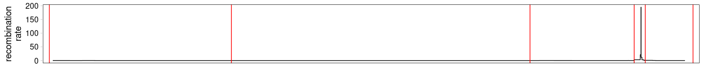

Recombination map
================

## Recombination map at the amy region

``` bash
conda create -c bioconda -n ucsc-bigwigtobedgraph ucsc-bigwigtobedgraph
conda activate ucsc-bigwigtobedgraph
bigWigToBedGraph -chrom=chr1 -start=103458352 -end=103863961 http://hgdownload.soe.ucsc.edu/gbdb/hg38/recombRate/recombAvg.bw /global/scratch/users/nicolas931010/amylase_diversity_project/HPRC_AMY_Sequences/recombination_rate/recombination_rate.bed
bigWigToBedGraph http://hgdownload.soe.ucsc.edu/gbdb/hg38/recombRate/recombAvg.bw /global/scratch/users/nicolas931010/amylase_diversity_project/HPRC_AMY_Sequences/recombination_rate/recombination_rate_hg38.bed
```

``` r
library(tidyverse)
```

    ## ── Attaching core tidyverse packages ──────────────────────── tidyverse 2.0.0 ──
    ## ✔ dplyr     1.1.2     ✔ readr     2.1.4
    ## ✔ forcats   1.0.0     ✔ stringr   1.5.0
    ## ✔ ggplot2   3.4.2     ✔ tibble    3.2.1
    ## ✔ lubridate 1.9.2     ✔ tidyr     1.3.0
    ## ✔ purrr     1.0.1     
    ## ── Conflicts ────────────────────────────────────────── tidyverse_conflicts() ──
    ## ✖ dplyr::filter() masks stats::filter()
    ## ✖ dplyr::lag()    masks stats::lag()
    ## ℹ Use the conflicted package (<http://conflicted.r-lib.org/>) to force all conflicts to become errors

``` r
recombination_plot <- read_tsv("recombination_rate.bed", col_names = c("chr", "start", "end", "r")) %>% #View()
  #filter(r<10) %>%
  ggplot(aes(x=start, y=r)) +
  geom_step() +
  geom_vline(xintercept = c(103456163, 103571526, 103760698, 103826698, 103833698, 103863961), color="red") +
  scale_x_continuous(expand=c(0.01,0.01)) +
  ylab("recombination\nrate") +
  cowplot::theme_minimal_grid() +
  theme(panel.border = element_rect(fill=NA, color="black"),
        axis.ticks.x = element_blank(),
        axis.text.x = element_blank(),
        axis.title.x = element_blank(),
        panel.grid = element_blank())
```

    ## Rows: 38 Columns: 4
    ## ── Column specification ────────────────────────────────────────────────────────
    ## Delimiter: "\t"
    ## chr (1): chr
    ## dbl (3): start, end, r
    ## 
    ## ℹ Use `spec()` to retrieve the full column specification for this data.
    ## ℹ Specify the column types or set `show_col_types = FALSE` to quiet this message.

``` r
recombination_plot
```

<!-- -->

``` r
ggsave("recombination_plot.pdf", recombination_plot, width = 15, height = 1.5, units = "in")
```

## Distribution of regions with suppressed recombination

``` r
library(IRanges)
library(cowplot)
low_recombination_rate_hg38 <- read_tsv("recombination_rate_hg38.bed", col_names = c("chr", "start", "end", "r")) %>%
  filter(r<1) 
low_recombination_region_hg38 <-NULL
start <- low_recombination_rate_hg38$start[1]
for (i in seq_len(nrow(low_recombination_rate_hg38)-1)){
  chr <- low_recombination_rate_hg38$chr[i]
  end <- low_recombination_rate_hg38$end[i]
  next_start <- low_recombination_rate_hg38$start[i+1]
  if(end!=next_start){
    low_recombination_region_hg38 <- bind_rows(low_recombination_region_hg38, tibble(chr, start, end))
    start=next_start
  } 
}
low_recombination_region_hg38 %>%
  mutate(length=end-start, amy=(chr=="chr1" & start < 103458352 & end > 103458352)) %>% #arrange(-length) %>% head(n=500) %>% View()
  ggplot(aes(x=length)) +
  geom_histogram(bins=50, fill="white", color="black") +
  geom_vline(data=low_recombination_region_hg38 %>% filter(chr=="chr1" & start < 103458352 & end > 103458352), mapping = aes(xintercept=(end-start)), color="red") +
  scale_x_log10() +
  theme_cowplot()
low_recombination_region_hg38 %>%
  mutate(length=end-start, length_bin=round(log(length))) %>%
  group_by(length_bin) %>%
  summarise(length_sum=sum(length), n=n()) %>%
  ggplot(aes(x=length_bin, y=n)) +
  geom_vline(data=low_recombination_region_hg38 %>% filter(chr=="chr1" & start < 103458352 & end > 103458352), mapping = aes(xintercept=log(end-start)), color="red") +
  geom_point()
```
