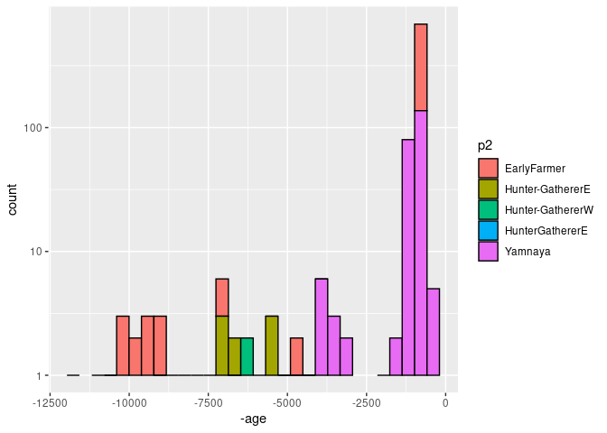
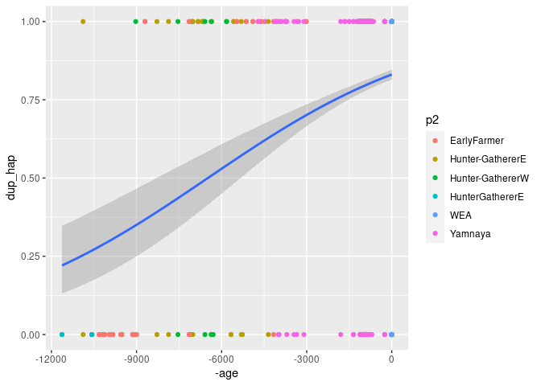
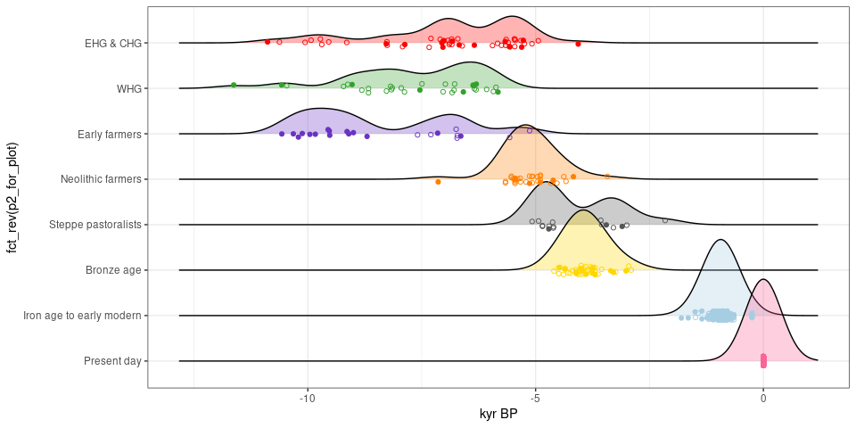
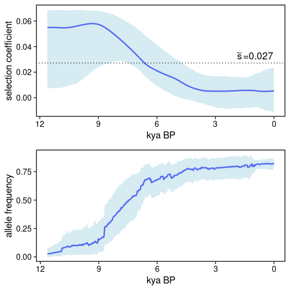

Inference of selection based on time series
================

- [Organizing the data](#organizing-the-data)
  - [Data wrangling](#data-wrangling)
  - [Prepare input for bmws](#prepare-input-for-bmws)
  - [Check whether Table S3 is
    complete](#check-whether-table-s3-is-complete)
- [bmws](#bmws)
  - [Run bmws](#run-bmws)
  - [Plot the result](#plot-the-result)
- [stdpopsim](#stdpopsim)

``` r
library(tidyverse)
library(cowplot)
library(googlesheets4)
```

## Organizing the data

#### Data wrangling

``` r
sample_age_allentoft_ancient <- read_tsv("ancient_info.tsv") %>%
  transmute(sample, age=parse_double(ageAverage))
sample_age_excoffier_ancient <- read_tsv("../../read_depth_genotyping/d4_cvg_analysis/bam_to_d4/meta_data/ExcoffierAncients.tsv") %>%
  transmute(sample = SAMPLE_ID, age=parse_double(AGE_AVG_BP))
sample_age_ancient <- bind_rows(sample_age_allentoft_ancient, sample_age_excoffier_ancient)
genotype_raw <- read_sheet("https://docs.google.com/spreadsheets/d/1q7L_dfSoj3yWWtlTGqV2eXCI-H1aFr0QDERYF6J7LXU/edit#gid=1746085135", sheet = "Sheet3", skip = 1)
genotype <- genotype_raw %>% 
  filter(cohort %in% c("ExcoffierAncient", "StoneAgeAncient") | p2 == "WEA", cohort !="1KG_trio") %>%
  left_join(sample_age_ancient) %>%
  filter(!(is.na(age) & cohort %in% c("ExcoffierAncient", "StoneAgeAncient"))) %>% 
  filter((!cohort %in% c("ExcoffierAncient", "StoneAgeAncient")) | age< 12000) %>%
  mutate(age=ifelse(is.na(age), 0, age))
genotype %>% count(cohort)
```

    ## # A tibble: 5 × 2
    ##   cohort               n
    ##   <chr>            <int>
    ## 1 1KG                503
    ## 2 ExcoffierAncient    14
    ## 3 HGDP               290
    ## 4 SGDP                76
    ## 5 StoneAgeAncient    274

``` r
genotype %>%
  filter(age>0) %>%
  ggplot(aes(x=-age, fill=p2))+
  geom_histogram(color="black") +
  scale_y_log10()
```

<!-- -->

``` r
genotype_long <- genotype %>%
  pivot_longer(cols=c(H1, H2), names_to = "hap", values_to = "structure") %>%
  mutate(dup_hap=case_when(structure %in% c("H1^a", "H2A0") ~ 0,
                           TRUE ~ 1))
count(genotype_long, structure, dup_hap) %>% arrange(-n)
```

    ## # A tibble: 11 × 3
    ##    structure dup_hap     n
    ##    <chr>       <dbl> <int>
    ##  1 H3^r            1  1001
    ##  2 H5              1   439
    ##  3 H1^a            0   301
    ##  4 H7              1   208
    ##  5 H2A0            0   146
    ##  6 H4A2B2          1   144
    ##  7 H2A2B2          1    40
    ##  8 H4A2            1    20
    ##  9 H3A3B3          1     8
    ## 10 H9              1     6
    ## 11 H3A2            1     1

``` r
genotype_long %>%
  ggplot(aes(x=-age, y=dup_hap)) +
  geom_point(aes(color=p2)) +
  geom_smooth(method = "glm", 
              method.args = list(family = "binomial"), 
              se = TRUE) 
```

<!-- -->

``` r
genotype_wide <- genotype_long %>%
  pivot_wider(names_from = hap, values_from = c(structure, dup_hap)) %>%
  mutate(dup_hap_geno = dup_hap_H1 + dup_hap_H2) %>% 
  arrange(sample)
genotype_wide %>%
  ggplot(aes(x=-age, y=dup_hap_geno)) +
  geom_point(aes(color=p2)) +
  geom_smooth() 
```

<!-- -->

``` r
genotype_wide %>% 
  count(p2, dup_hap_geno)
```

    ## # A tibble: 16 × 3
    ##    p2               dup_hap_geno     n
    ##    <chr>                   <dbl> <int>
    ##  1 EarlyFarmer                 0    12
    ##  2 EarlyFarmer                 1     4
    ##  3 EarlyFarmer                 2    11
    ##  4 Hunter-GathererE            0     2
    ##  5 Hunter-GathererE            1     8
    ##  6 Hunter-GathererE            2     5
    ##  7 Hunter-GathererW            0     1
    ##  8 Hunter-GathererW            1     4
    ##  9 Hunter-GathererW            2     1
    ## 10 HunterGathererE             0     2
    ## 11 WEA                         0    35
    ## 12 WEA                         1   235
    ## 13 WEA                         2   599
    ## 14 Yamnaya                     0     7
    ## 15 Yamnaya                     1    78
    ## 16 Yamnaya                     2   153

#### Prepare input for bmws

``` r
genotype_wide %>%
  transmute(`#CHROM`=1,
            POS=1,
            ID=1,
            REF="A",
            ALT="T",
            QUAL=100,
            FILTER="PASS",
            INFO=".",
            FORMAT="GT",
            sample, 
            genotype=case_when(dup_hap_geno==0 ~"0/0",
                                            dup_hap_geno==1 ~"0/1",
                                            dup_hap_geno==2 ~"1/1")) %>%
  pivot_wider(names_from = sample, values_from = genotype) %>%
  write_tsv("bmws/amy.vcf.gz")
genotype_wide %>%
  transmute(`#ID`=sample, DateBP=round(age)) %>%
  write_tsv("bmws/amy.meta")
genotype_count <- genotype_long %>%
  mutate(generation=389-round(age/30)) %>%
  count(generation, dup_hap) %>%
  pivot_wider(names_from = dup_hap, values_from=n) %>%
  rename(n_ref=`0`, n_alt=`1`) %>%
  left_join(tibble(generation=1:389), .) %>%
  replace(is.na(.), 0) %>%
  transmute(generation, n_obs=n_ref+n_alt, n_ref, n_alt) 
genotype_count %>%
  dplyr::select(-generation, -n_ref) %>%
  write_tsv("bmws/amy.txt", col_names = FALSE)
genotype_count %>%
  dplyr::select(-n_obs) %>%
  pivot_longer(cols = 2:3, names_to = "hap", values_to = "n") %>%
  filter(generation<389) %>%
  ggplot(aes(x=round(generation, -1), y=n, fill=hap)) +
  geom_col()
read_tsv("../../src/bmws/paper/data/data/Britain_LCT.txt", col_names = c("n_obs", "n_alt")) %>%
  transmute(generation=row_number(), n_ref=n_obs-n_alt, n_alt) %>%
  pivot_longer(cols = 2:3, names_to = "hap", values_to = "n") %>%
  ggplot(aes(x=round(generation, -1), y=n, fill=hap)) +
  geom_col()
```

#### Check whether Table S3 is complete

``` r
genotype_raw <- read_tsv("../result_tsv/new_results/best_geno/best_geno_tot.tsv", col_names = c("sample", "besthaplo1_besthaplo2",  "best_score", "cohort")) %>%
  separate(besthaplo1_besthaplo2,into=c("hap1","hap2"),sep="\\$",extra="merge") %>%
  filter(cohort!="SGDP") %>%
  mutate(cohort=ifelse(cohort=="SGDPv2","SGDP",cohort)) %>%
  mutate(cohort=ifelse(cohort=="1K","1KG",cohort)) %>%
  mutate(cohort=ifelse(cohort=="1KGrel","1KG_trio",cohort)) %>%
  mutate(hap1=str_replace(hap1,"-","_")) %>%
  mutate(hap2=str_replace(hap2,"-","_")) %>% 
  filter(cohort %in% c("Allentoft", "1KG", "1KG_trio", "Excoffier", "SGDP", "HGDP","GTEx"))
sample_info <- read_tsv("../../read_depth_genotyping/genotyping/output/genotypes.likelihoods.tsv", col_names = TRUE) %>% 
  dplyr::select(sample) %>% 
  separate(sample,c("cohort","sample","p1","p2"),sep = "\\.") %>% 
  unique() 
genotype_filtered <- genotype_raw %>%
  filter(best_score > 0.7) %>% 
  inner_join(sample_info %>% dplyr::select(-cohort), by="sample") %>%
  left_join(metadata_ancient) %>%
  filter(!(is.na(age) & cohort %in% c("Allentoft", "Excoffier"))) %>% 
  filter((!cohort %in% c("Allentoft", "Excoffier")) | age< 12000)
count(genotype_filtered, cohort)
```

## bmws

(<https://github.com/jthlab/bmws>)

#### Run bmws

``` bash
## installation
mamba create -c conda-forge -c bioconda -n bmws python==3.10 zlib==1.2.13 pandas numpy pip gcc bcftools
conda activate bmws
pip install -e git+https://github.com/jthlab/bmws#egg=bmws
#bmws test
#bmws analyze -h
## run bmws
cd /global/scratch/users/nicolas931010/amylase_diversity_project/graph_genotyping/assess_graph_genotypes/bmws
bmws analyze amy.vcf.gz amy.meta -d diploid -l 4.5 -g 30 -n 10000 -t -o amy.out
bmws analyze amy.vcf.gz amy.meta -d diploid -l 4.5 -g 30 -n 100000 -t -o amy.n100000.out

## or, run the python script
cd /global/scratch/users/nicolas931010/amylase_diversity_project/src/bmws/src/bmws
## estimate s
python /global/scratch/users/nicolas931010/amylase_diversity_project/graph_genotyping/assess_graph_genotypes/bmws/amy.1.py
## run 1000 bootstraps
for SEED in {10..999}; do
  echo '#!/bin/bash
  source ~/.bashrc
  conda activate bmws
  cd /global/scratch/users/nicolas931010/amylase_diversity_project/src/bmws/src/bmws
  python /global/scratch/users/nicolas931010/amylase_diversity_project/graph_genotyping/assess_graph_genotypes/bmws/amy.2.py '${SEED} |
  sbatch \
    --time=60 \
    --nodes=1 \
    --cpus-per-task=1 \
    --account=co_genomicdata \
    --partition=savio4_htc \
    --qos=savio_lowprio \
    --output=/global/scratch/users/nicolas931010/amylase_diversity_project/graph_genotyping/assess_graph_genotypes/bmws/bootstrap/amy.s_hat.${SEED}.log
done
```

#### Plot the result

``` r
s_mean <- read_lines("bmws/amy.out") %>%
  str_split(pattern = "\t") %>%
  .[[1]] %>%
  .[7] %>%
  parse_double()
s_trajectory <- read_lines("bmws/amy.out") %>%
  str_split(pattern = "\t") %>%
  .[[1]] %>%
  .[-(1:9)] %>% 
  parse_double() %>%
  tibble(s=.) %>%
  transmute(generation=1:387, time=(387-generation)*30, s)
s_trajectory %>%
  ggplot(aes(x=generation, y=s)) +
  geom_line()
```

<!-- -->

``` r
s_trajectory %>%
  ggplot(aes(x=-time/1000, y=s)) +
  geom_line() +
  geom_hline(yintercept = s_mean, linetype=3) +
  scale_x_continuous(breaks = -4:0*3, labels = 4:0*3) +
  scale_y_continuous(breaks=0:3 * 0.02) +
  ylim(c(0, 0.06)) +
  xlab("kya BP") +
  theme_cowplot()
```

<!-- -->

``` r
s_hat <- read_tsv("bmws/amy.s_hat.txt", col_names = "s") %>%
  mutate(generation=388:1, time=(388-generation)*30)
s_hat_mean=mean(s_hat$s)
paths <- read_tsv("bmws/amy.paths.tsv", col_names = FALSE) %>%
  pivot_longer(cols = 1:389, names_to = "name", values_to = "p") %>%
  mutate(generation=390-parse_number(name), time=(389-generation)*30) %>%
  group_by(time, generation) %>%
  summarise(p_mean=mean(p), p_lower = quantile(p, 0.025), p_higher=quantile(p, 0.975))
s_ci <- read_tsv(str_c("bmws/bootstrap/amy.s_hat.", 0:999, ".txt"), col_names = "s") %>%
  mutate(generation=rep(388:1, 1000), time=(388-generation)*30) %>%
  group_by(time, generation) %>%
  summarise(s_mean=mean(s), s_lower = quantile(s, 0.025), s_higher=quantile(s, 0.975))
s_plot <- s_hat %>%
  ggplot(aes(x=-time/1000)) +
  geom_line(aes(y=s), color="blue", size=1) +
  #geom_line(data=s_ci, mapping = aes(y=s_mean)) +
  geom_ribbon(data=s_ci, aes(ymin=s_lower, ymax=s_higher), fill="lightblue", alpha=0.5) +
  annotate(geom = "text", x=-1.78, y=s_hat_mean*1.2, label="bar(s)", parse=TRUE, size=5) +
  annotate(geom = "text", x=-0.8, y=s_hat_mean*1.2, label=str_c("=", round(s_hat_mean, 3)), size=5) +
  geom_hline(yintercept = s_hat_mean, linetype=3) +
  scale_x_continuous(breaks = -4:0*3, labels = 4:0*3) +
  scale_y_continuous(breaks=0:3 * 0.02) +
  xlab("kya BP") +
  ylab("selection coefficient") +
  theme_cowplot() +
  theme(axis.line = element_blank(),
        panel.border = element_rect(color="black", size=1))
p_plot <- paths %>%
  ggplot(aes(x=-time/1000)) +
  geom_line(aes(y=p_mean), color="blue", size=1) +
  geom_ribbon(aes(ymin=p_lower, ymax=p_higher), fill="lightblue", alpha=0.5) +
  scale_x_continuous(breaks = -4:0*3, labels = 4:0*3) +
  xlab("kya BP") +
  ylab("allele frequency") +
  theme_cowplot() +
  theme(axis.line = element_blank(),
        panel.border = element_rect(color="black", size=1))
combined_plot <- plot_grid(s_plot, p_plot, nrow = 2, align = "hv")
combined_plot
```

<!-- -->

``` r
ggsave("bmws/s_p_plot.pdf", combined_plot, width = 6, height = 6)
```

## stdpopsim

``` bash
mamba create -c conda-forge -c bioconda -n stdpopsim stdpopsim==0.2.0
```
