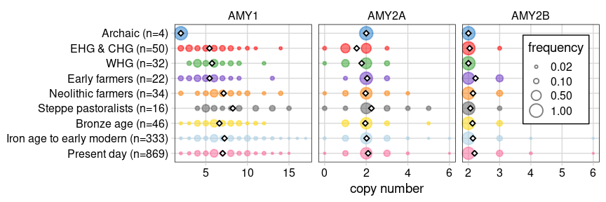
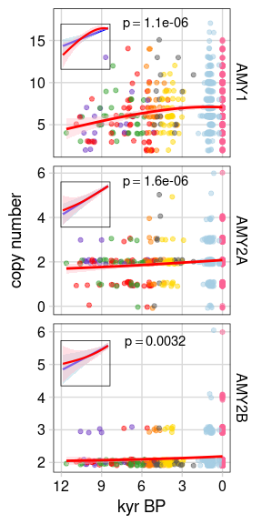
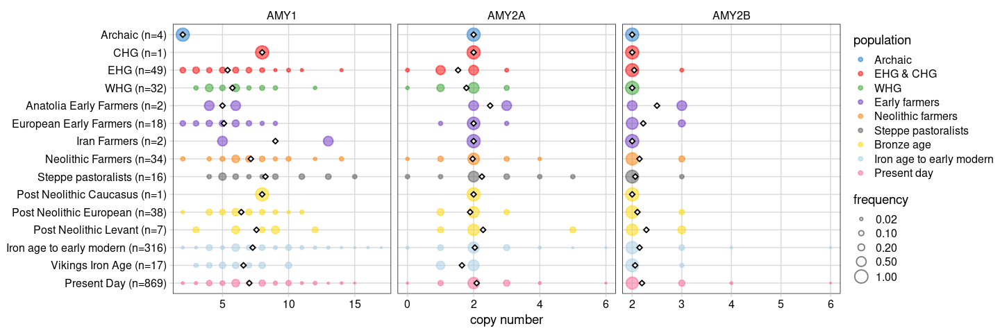
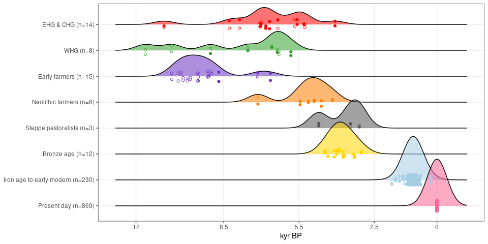
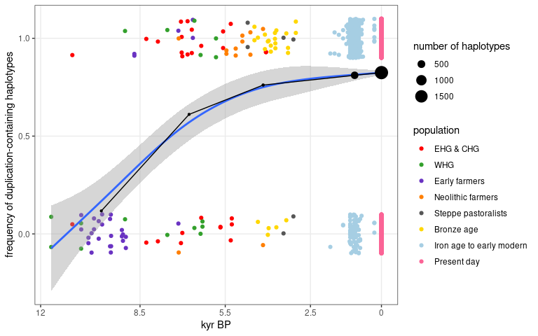
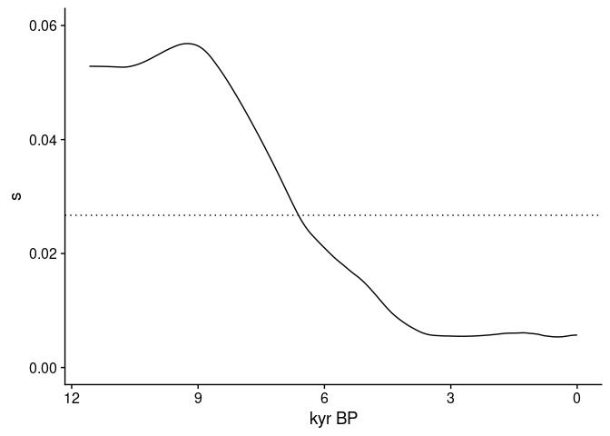
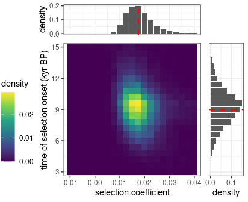
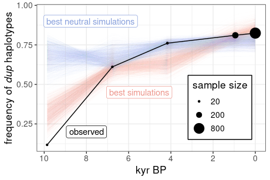
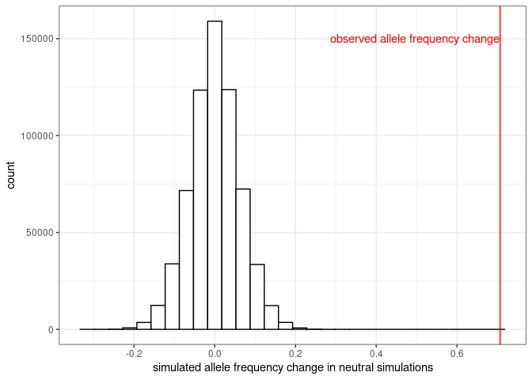

Inference of selection based on time series
================

- [Organizing the data](#organizing-the-data)
  - [Data wrangling](#data-wrangling)
  - [Prepare input for bmws](#prepare-input-for-bmws)
  - [Check whether Table S3 is
    complete](#check-whether-table-s3-is-complete)
- [bmws](#bmws)
  - [Run bmws](#run-bmws)
  - [Plot the result](#plot-the-result)
- [slim](#slim)
- [stdpopsim](#stdpopsim)

``` r
library(tidyverse)
library(cowplot)
library(googlesheets4)
library(ggridges)
library(rjson)
library(readxl)
library(ggpp)
library(broom)
```

## Organizing the data

#### Data wrangling

``` r
## meta data
meta_data_allentoft_sample_id <- fromJSON(file="../../read_depth_genotyping/d4_cvg_analysis/bam_to_d4/meta_data/config_final_ancient_info.json")  %>% 
  as_tibble() %>% 
  colnames()
meta_data_allentoft <- fromJSON(file="../../read_depth_genotyping/d4_cvg_analysis/bam_to_d4/meta_data/config_final_ancient_info.json")  %>% 
  as_tibble() %>% 
  t() %>% 
  as_tibble() %>% 
  unnest() %>%
  transmute(sample=meta_data_allentoft_sample_id, site=V3, country=V4, region=V5, latitude=parse_double(V11), longitude=parse_double(V12), age=parse_double(V18), data_source=V14, pop_grouping=V28) 
meta_data_excoffier <- read_tsv("../../read_depth_genotyping/d4_cvg_analysis/bam_to_d4/meta_data/ExcoffierAncients.tsv") %>%
  transmute(sample = SAMPLE_ID, site=SITE, country=COUNTRY, latitude=LAT, longitude=LONG, age=parse_double(AGE_AVG_BP), data_source = PAPER, pop_grouping=MAIN_CLUSTER)
meta_data_ancient <- bind_rows(meta_data_allentoft, meta_data_excoffier)
## copy number
copy_number_raw <- read_sheet("https://docs.google.com/spreadsheets/d/1q7L_dfSoj3yWWtlTGqV2eXCI-H1aFr0QDERYF6J7LXU/edit#gid=1746085135", sheet = "Table S1", skip = 1)
copy_number_wide <- copy_number_raw %>%
  pivot_wider(names_from = label, values_from = copy) %>%
  left_join(meta_data_ancient, by="sample") %>%
  filter(!(is.na(age) & source=="ExcoffierAncient")) %>%
  mutate(age=ifelse(is.na(age) & source != "Archaic" & source != "ExcoffierAncient", 0, age))
copy_number_ancient_wide <- copy_number_wide %>% 
  filter(source %in% c("ExcoffierAncient", "StoneAgeAncient"))
## concensus haplotype
genotype_raw <- read_sheet("https://docs.google.com/spreadsheets/d/1q7L_dfSoj3yWWtlTGqV2eXCI-H1aFr0QDERYF6J7LXU/edit#gid=1746085135", sheet = "Table S4", skip = 1)
genotype <- genotype_raw %>% 
  filter(cohort %in% c("ExcoffierAncient", "StoneAgeAncient") | p2 == "WEA", cohort !="1KG_trio") %>%
  left_join(meta_data_ancient) %>%
  filter(!(is.na(age) & cohort %in% c("ExcoffierAncient", "StoneAgeAncient"))) %>% 
  filter((!cohort %in% c("ExcoffierAncient", "StoneAgeAncient")) | age< 12000) %>%
  mutate(age=ifelse(is.na(age), 0, age),
         p2=ifelse(p2=="HunterGathererE", "Hunter-GathererE", p2))
genotype %>% count(cohort)
genotype %>%
  filter(age>0) %>%
  ggplot(aes(x=-age, fill=p2))+
  geom_histogram(color="black") +
  geom_vline(xintercept=c(-200*29, -140*29))
genotype_long <- genotype %>%
  pivot_longer(cols=c(H1, H2), names_to = "hap", values_to = "structure") %>%
  mutate(dup_hap=case_when(structure %in% c("H1^a", "H2A0") ~ 0,
                           TRUE ~ 1))
count(genotype_long, structure, dup_hap) %>% arrange(-n)
## Ale's new labels
new_p2_labels <- read_sheet("https://docs.google.com/spreadsheets/d/1W2yYuTdOarUMVi5hampNedvFMZjuAOsZl6O_Kyx2xZE", sheet = "AR", col_names = FALSE, skip=1, n_max = 534) %>%
  transmute(sample=`...2`, source_ar = `...5`, p2_ar=`...8`) %>%
  mutate(p2_ar = case_when(p2_ar=="X - WHG?" ~ "WHG",
                           p2_ar=="X - Bronze Age?" ~ "Bronze Age",
                           p2_ar=="X - Iron Age?" ~ "Iron Age",
                           TRUE ~ p2_ar))
copy_number_wide %>%
  write_tsv("amy_copy_number.tsv")
copy_number_ancient_wide %>%
  write_tsv("amy_copy_number.ancient_only.tsv")
genotype_long %>%
  write_tsv("haplotype_structure.tsv")
new_p2_labels %>%
  write_tsv("new_labels_ar.tsv")
```

``` r
copy_number_wide <- read_tsv("amy_copy_number.tsv")
genotype_long <- read_tsv("haplotype_structure.tsv")
new_p2_labels <- read_tsv("new_labels_ar.tsv")
generation_time <- 30

genotype_wide <- genotype_long %>%
  pivot_wider(names_from = hap, values_from = c(structure, dup_hap)) %>%
  mutate(dup_hap_geno = dup_hap_H1 + dup_hap_H2) %>% 
  arrange(sample)
master_table_wide <- copy_number_wide %>%
  filter(!is.na(age), source != "1KG_trio") %>%
  filter(age > 0 | p2 == "WEA") %>%
  mutate(p2=ifelse(p2=="HunterGathererE", "Hunter-GathererE", p2)) %>%
  left_join(genotype_wide) %>%
  left_join(new_p2_labels) %>%
  mutate(p2_ar=ifelse(p2=="WEA", "WEA", p2_ar)) %>%
  mutate(p2_ar=fct_relevel(p2_ar, c("EHG", "WHG", "CHG", "Farmers", "Steppe", "Bronze Age", "Iron Age", "Viking Age", "Medieval Early Modern", "WEA"))) %>%
  mutate(epoc = cut(-age, 
                    breaks = c(-1500*generation_time,
                               -800*generation_time,
                               -600*generation_time,
                               -259*generation_time,
                               -177*generation_time,
                               -166*generation_time,
                               -1,
                               0), 
                    labels = c("after NE WA split",
                               "after CHG ANA split",
                               "after EHG WHG split",
                               "after NEO formation",
                               "after YAM formation",
                               "after BRO formation",
                               "modern"))) %>%
  mutate(p2_new=case_when(p2_ar %in% c("WHG", "Farmers") & epoc %in% c("after NEO formation", "after YAM formation") ~ "Neolithic farmers",
                          p2_ar =="Farmers" & epoc == "after EHG WHG split" ~ "Anatolian farmers",
                          p2_ar %in% c("EHG", "CHG") & epoc == "after YAM formation" ~ "Steppe",
                          p2_ar %in% c("Iron Age", "Viking Age", "Medieval Early Modern") ~ "Iron age to early modern",
                          p2_ar == "WEA" ~ "Modern",
                          epoc=="after BRO formation" ~ "Bronze age",
                          p2_ar %in% c("EHG", "CHG") ~ "EHG & CHG",
                          #epoc=="after BRO formation" ~ "Bronze age to early modern",
                          TRUE~p2_ar)) %>% 
  mutate(p2_new=fct_relevel(p2_new, c("WHG", "EHG & CHG", "Anatolian farmers", "Neolithic farmers", "Steppe", "Bronze age", "Iron age to early modern",  "Modern"))) %>%
  mutate(p2_validation_needed = case_when(p2_ar %in% c("WHG", "Farmers") & epoc %in% c("after NEO formation", "after YAM formation") ~ TRUE,
                                          p2_ar %in% c("EHG", "CHG") & epoc == "after YAM formation" ~ TRUE,
                                          p2_ar %in% c("WHG", "EHG", "Farmers", "Steppe") & epoc == "after BRO formation" ~ TRUE,
                                          TRUE ~ FALSE)) %>%
  mutate(data_source=ifelse(is.na(source_ar), source, source_ar)) %>%
  dplyr::select(sample, p1, p2, p2_ar, p2_new, p2_validation_needed, epoc, age, latitude, longitude, site, country, region, data_source, AMY1, AMY2A, AMY2B, structure_H1, structure_H2, dup_hap_H1, dup_hap_H2, best_matching_score) %>%
  ## use the following line to control which population label to plot
  mutate(p2_final=p2_new) 
master_table_wide %>% write_tsv("master_table_wide.tsv")

archaic_samples <- read_sheet("https://docs.google.com/spreadsheets/d/1q7L_dfSoj3yWWtlTGqV2eXCI-H1aFr0QDERYF6J7LXU/edit#gid=1746085135", sheet = "Table S1", skip = 1) %>% 
  filter(source=="Archaic") %>% 
  pivot_wider(names_from = label, values_from = copy)
write_tsv(archaic_samples, "archaic_samples.tsv")

non_wea_modern_samples_haplotype_wide <- read_sheet("https://docs.google.com/spreadsheets/d/1q7L_dfSoj3yWWtlTGqV2eXCI-H1aFr0QDERYF6J7LXU/edit#gid=1746085135", sheet = "Table S4", skip = 1) %>% 
  filter(! cohort %in% c("ExcoffierAncient", "StoneAgeAncient")) %>%
  filter(cohort == "1KG_trio" | p2 != "WEA")
pivot_wider(names_from = label, values_from = copy)
write_tsv(non_wea_modern_samples_haplotype_wide, "haplotype_structure_non_wea_modern.tsv")
```

``` r
p2_colors <- pals::cols25()
archaic_samples <- read_tsv("archaic_samples.tsv") %>%
  mutate(p2="Archaic")
master_table_wide <- read_tsv("master_table_wide.tsv") %>%
  left_join(readxl::read_excel("master_table_wide_ar.xlsx", na = "NA") %>% dplyr::select(sample, p2_l0, p2_L1)) %>%
  bind_rows(archaic_samples) %>%
  mutate(p2_l0=ifelse(sample =="NEO816", "EarlyFarmers", p2_l0)) %>%
  mutate(p2_L1=ifelse(sample =="NEO816", "Iran Farmers", p2_L1)) %>%
  mutate(p2_L1=ifelse(p2_L1 == "Iran Farmer", "Iran Farmers", p2_L1)) %>%
  mutate(p2_L1=ifelse(p2_L1 == "Anatolia and / Early Farmers" & longitude < 25, "Europen Early Farmers", p2_L1)) %>%
  mutate(p2=case_when(p2_l0 == "EarlyFarmers" ~ "Early farmers",
                      p2_l0 == "Europen Farmers" ~ "Neolithic farmers",
                      p2_l0 == "Steppe" ~ "Steppe pastoralists",
                      p2_l0 == "PostNeolithic_BA" ~ "Bronze age",
                      p2_l0 == "present day" ~ "WEA",
                      p2_l0 == "EHG & CHG" & p2_ar == "CHG" ~ "CHG",
                      p2_l0 == "EHG & CHG" ~ "EHG",
                      is.na(p2_l0) ~ p2,
                      TRUE ~ p2_l0)) %>%
  mutate(p2=fct_relevel(p2, c("Archaic",
                              "CHG",
                              "EHG",
                              "WHG",
                              "Early farmers",
                              "Neolithic farmers",
                              "Steppe pastoralists",
                              "Bronze age",
                              "Iron age to early modern",
                              "WEA"))) %>%
  mutate(p2_for_plot=case_when(p2 %in% c("EHG", "CHG") ~ "EHG & CHG", 
                               p2 == "WEA" ~ "Present day",
                               TRUE ~ p2)) %>%
  mutate(p2_for_plot=fct_relevel(p2_for_plot, c("Archaic",
                                                "EHG & CHG",
                                                "WHG",
                                                "Early farmers",
                                                "Neolithic farmers",
                                                "Steppe pastoralists",
                                                "Bronze age",
                                                "Iron age to early modern",
                                                "Present day"))) %>%
  mutate(p2_for_simulation=case_when(p2 == "Early farmers" ~ "ANA",
                                     p2 == "Neolithic farmers" ~ "NEO",
                                     p2 == "Steppe pastoralists" ~ "YAM",
                                     p2 %in% c("Bronze age", "Iron age to early modern", "WEA")  ~ "BRO",
                                     p2 == "Bronze age" ~ "BRO",
                                     p2 == "Archaic" ~ NA,
                                     TRUE ~ p2)) %>%
  mutate(p2_for_supplement=case_when(p2_L1 == "Anatolia and / Early Farmers" ~ "Anatolia Early Farmers",
                                     p2_L1 == "EHG Genetically - to remove?" ~ "EHG",
                                     p2_L1 == "EHG & CHG" & p2_ar == "CHG" ~ "CHG",
                                     p2_L1 == "EHG & CHG" ~ "EHG",
                                     p2_L1 == "Europen Early Farmers" ~ "European Early Farmers",
                                     p2_L1 == "Europen Farmers" ~ "Neolithic Farmers",
                                     p2_L1 == "Steppe" ~ "Steppe pastoralists",
                                     p2_L1 == "Vikings Iron Age, peculiar. To remove?" ~ "Vikings Iron Age",
                                     p2_L1 == "present day" ~ "Present Day",
                                     p2 == "Archaic" ~ "Archaic",
                                     TRUE ~ p2_L1)) %>%
  mutate(p2_for_supplement=fct_reorder(p2_for_supplement, p2_for_plot, function(x){median(as.numeric(x))})) %>%
  mutate(epoc=fct_relevel(epoc, c("after NE WA split",
                                  "after CHG ANA split",
                                  "after EHG WHG split",
                                  "after NEO formation",
                                  "after YAM formation",
                                  "after BRO formation",
                                  "modern"))) %>%
  rename(epoch=epoc) %>%
  mutate(hap_availability=!is.na(structure_H1)) 
```

    ## Warning: There was 1 warning in `mutate()`.
    ## ℹ In argument: `epoc = fct_relevel(...)`.
    ## Caused by warning:
    ## ! 2 unknown levels in `f`: after NE WA split and after CHG ANA split

``` r
copy_number_long <- master_table_wide %>%
  dplyr::select(sample, p2, p2_for_plot, p2_for_supplement, epoch, age, latitude, longitude, AMY1, AMY2A, AMY2B) %>%
  pivot_longer(cols = AMY1:AMY2B, names_to="gene", values_to = "copy_number") 

## only include samples with confident haplotype structure calls
# copy_number_relabelled <- copy_number_relabelled %>%
#   filter(sample %in% genotype_long$sample)

copy_number_long %>%
  ## only include samples with confident haplotype structure calls
  #filter(sample %in% genotype_long$sample) %>%
  ## only include samples whose p2 labels need to be checked
  #filter(p2_validation_needed) %>%
  group_by(epoch, p2, gene) %>%
  summarise(n=n(), copy_number=mean(copy_number)) %>%
  ungroup() %>%
  arrange(gene) %>%
  group_by(epoch, p2, n) %>%
  summarise(copy_number=str_c(round(copy_number,1), collapse = " ")) %>%
  transmute(p2, epoch, mean_amy_copy_number=str_c(copy_number,
                                                  "( n=",
                                                  n,
                                                  ")",
                                                  sep = " ")) %>% 
  arrange(epoch, p2) %>%
  pivot_wider(names_from = p2, values_from = mean_amy_copy_number)
```

    ## # A tibble: 6 × 11
    ## # Groups:   epoch [6]
    ##   epoch               CHG        EHG   WHG   `Early farmers` `Neolithic farmers`
    ##   <fct>               <chr>      <chr> <chr> <chr>           <chr>              
    ## 1 after EHG WHG split 8 2 2 ( n… 4.2 … 6 1.… 5.2 2.2 2.3 ( … <NA>               
    ## 2 after NEO formation <NA>       5.9 … 5.5 … 6.1 1.9 2.1 ( … 7.9 2.2 2.1 ( n= 1…
    ## 3 after YAM formation <NA>       3.8 … <NA>  4 2 2 ( n= 1 )  6 1.3 2.2 ( n= 6 ) 
    ## 4 after BRO formation <NA>       7 2 … <NA>  <NA>            6.8 2 2.2 ( n= 13 )
    ## 5 modern              <NA>       <NA>  <NA>  <NA>            <NA>               
    ## 6 <NA>                <NA>       <NA>  <NA>  <NA>            <NA>               
    ## # ℹ 5 more variables: `Steppe pastoralists` <chr>, `Bronze age` <chr>,
    ## #   `Iron age to early modern` <chr>, WEA <chr>, Archaic <chr>

``` r
## supplementary tables
## copy number
copy_number_table_for_supplement <- read_tsv("amy_copy_number.tsv") %>%
  filter(! source %in% c("ExcoffierAncient", "StoneAgeAncient", "Archaic")) %>%
  filter(source == "1KG_trio" | p2 != "WEA") %>%
  bind_rows(master_table_wide %>% mutate(source=data_source) %>% mutate(source=ifelse(is.na(source), "Archaic", source))) %>%
  mutate(type=case_when(source %in% c("1KG", "HGDP", "SGDP") ~ "Modern",
                        source %in% c("Allentoft_Sikora_etal2024", "Allentoft_etal2015", "Marchi_etal2022", "Margaryan_etal2020") ~ "Ancient",
                        source == "Archaic" ~ "Archaic",
                        source == "1KG_trio" ~ "Trio",
                        source == "GTEx" ~ "GTEx")) %>%
  mutate(type=fct_relevel(type, c("Archaic", "Ancient", "Modern", "Trio", "GTEx"))) %>%
  transmute(type, source, sample, p1, p2, AMY1, AMY2A, AMY2B) %>%
  arrange(type, source, p2, p1, sample)
copy_number_table_for_supplement %>% count(source)
copy_number_table_for_supplement %>% count(type)
write_tsv(copy_number_table_for_supplement, "supplementary_tables/copy_number_table_for_supplement.tsv")
## haplytype structure
haplotype_structure_for_supplement <- read_tsv("haplotype_structure_non_wea_modern.tsv") %>%
  rename(source=cohort) %>%
  bind_rows(master_table_wide %>% mutate(source=data_source) %>% rename(H1=structure_H1, H2=structure_H2)) %>%
  filter(!is.na(H1)) %>%
  mutate(type=case_when(source %in% c("1KG", "HGDP", "SGDP") ~ "Modern",
                        source %in% c("Allentoft_Sikora_etal2024", "Allentoft_etal2015", "Marchi_etal2022", "Margaryan_etal2020") ~ "Ancient",
                        source == "1KG_trio" ~ "Trio")) %>%
  transmute(type, source, sample, p1, p2, best_matching_score, H1, H2) %>%
  arrange(type, source, p2, p1, sample)
write_tsv(haplotype_structure_for_supplement, "supplementary_tables/haplotype_structure_for_supplement.tsv")
## ancient metadata
ancient_metadata_for_supplement <- master_table_wide %>%
  filter(age > 0) %>%
  transmute(sample, p2_l0=p2, p2_l1=p2_for_supplement, site, country, region, age, latitude, longitude, data_source) %>%
  mutate(p2_l0=fct_relevel(p2_l0, c("CHG", 
                                    "EHG", 
                                    "WHG",
                                    "Early farmers",
                                    "Neolithic farmers",
                                    "Steppe pastoralists",
                                    "Bronze age",
                                    "Iron age to early modern"))) %>%
  arrange(p2_l0, p2_l1, desc(age))
write_tsv(ancient_metadata_for_supplement, "supplementary_tables/ancient_metadata_for_supplement.tsv")
```

``` r
set.seed(42)
master_table_wide %>%
  distinct(sample, age, p2_for_plot, hap_availability) %>% 
  filter(!is.na(age)) %>%
  ggplot(aes(x=-age/1000, y=fct_rev(p2_for_plot))) +
  ggridges::geom_density_ridges(aes(fill=p2_for_plot), alpha=0.3) +
  #ggridges::geom_density_ridges(mapping=aes(point_color=p2_for_plot, point_fill=p2_for_plot, point_shape=hap_availability), jittered_points = TRUE, position="raincloud", color=NA, alpha=0, point_alpha=1) +
  geom_jitter(aes(color=p2_for_plot, fill=p2_for_plot, shape=hap_availability), height = 0.1, alpha=1) +
  scale_shape_manual(values = c(1,21)) +
  scale_color_manual(values = p2_colors[-1]) +
  scale_fill_manual(values = p2_colors[-1]) +
  xlab("kyr BP") +
  #geom_vline(xintercept = -177*generation_time) +
  #scale_discrete_manual(aesthetics = "point_shape", values = c(1, 21)) +
  coord_cartesian(ylim=c(1, 8.2), expand = TRUE) +
  theme_bw() +
  theme(legend.position = "none")
```

<!-- -->

``` r
set.seed(42)
sample_age_distribution_plot <- master_table_wide %>%
  distinct(sample, age, p2_for_plot, hap_availability) %>% 
  filter(!is.na(age), age > 0) %>%
  ggplot(aes(x=-age/1000, y=fct_rev(p2_for_plot))) +
  # ggridges::geom_density_ridges(aes(fill=p2_for_plot), alpha=0.3) +
  ggridges::geom_density_ridges(mapping=aes(fill=p2_for_plot), jittered_points = TRUE, position="raincloud", point_size=0.5, alpha=0.5) +
  scale_color_manual(values = p2_colors[-1]) +
  scale_fill_manual(values = p2_colors[-1]) +
  # geom_jitter(aes(color=p2_for_plot, fill=p2_for_plot, shape=hap_availability), height = 0.1, alpha=1) +
  scale_x_continuous(breaks = -4:0*3, labels = 4:0*3) +
  theme_bw() +
  xlab("kyr BP") +
  coord_cartesian(ylim=c(1, 7.2), expand = TRUE) +
  theme(legend.position = "none",
        axis.title.y=element_blank(),
        panel.grid.minor = element_blank(),
        text=element_text(size=13))
sample_age_distribution_plot
#ggsave("figures/sample_age_distribution_plot.pdf", sample_age_distribution_plot, width=4, height=2)
```

``` r
europe_map <- map_data("world") %>% 
  filter(lat > 30, lat < 90, long > -60, long < 150)
set.seed(42)
ancient_map <- master_table_wide %>%
  filter(age>0) %>%
  distinct(sample, age, epoch, p2_for_plot, p2_for_supplement, latitude, longitude) %>% 
  rename(long=longitude, lat=latitude) %>%
  ggplot(aes(x=long, y=lat)) +
  geom_polygon(data=europe_map, mapping=aes(group = group), fill="grey80", color="white", linewidth=0.5) +
  scale_shape_manual(values = rep(21:25, 3)) +
  scale_fill_manual(values = p2_colors[-1]) +
  coord_map("gilbert", xlim = c(-35, 80), ylim=c(33, 72)) +
  cowplot::theme_map() +
  theme(panel.border = element_rect(color="black", fill=NA, linewidth = 2),
        legend.position = c(0.02, 0.25),
        legend.title = element_blank())
sample_distribution_map <- ancient_map +
  geom_jitter(aes(fill=p2_for_plot, shape=p2_for_plot), size=2, color="black", alpha=0.6, height = 0.3, width = 0.3)
sample_distribution_map
```

<!-- -->

``` r
#ggsave("figures/sample_distribution_map.pdf", sample_distribution_map, width=10, height = 4.8)
```

``` r
set.seed(42)
sample_distribution_facet_map <- ancient_map +
  geom_jitter(aes(fill=p2_for_supplement, shape=p2_for_supplement), size=2, color="black", alpha=0.8, height = 0.3, width = 0.3) +
  facet_grid(p2_for_plot~epoch) +
  theme(legend.position = "top")
sample_distribution_facet_map
```

<!-- -->

``` r
#ggsave("figures/sample_distribution_facet_map.pdf", sample_distribution_facet_map, width=18, height = 18)
#ggsave("figures/sample_distribution_facet_map.png", sample_distribution_facet_map, width=18, height = 18)
```

``` r
master_table_wide %>%
  filter(age>0, p2_validation_needed) %>%
  distinct(sample, age, epoch, p2_ar, latitude, longitude) %>% 
  rename(long=longitude, lat=latitude) %>%
  ggplot(aes(x=long, y=lat)) +
  geom_polygon(data=europe_map, mapping=aes(group = group), fill="grey80", color="white", linewidth=0.5) +
  geom_jitter(aes(fill=p2_ar, shape=p2_ar), size=2, color="black") +
  scale_shape_manual(values = rep(21:25, 3)) +
  facet_wrap(~epoch, ncol = 1) +
  coord_map("gilbert", xlim = c(-35, 80), ylim=c(33, 72)) +
  cowplot::theme_map() +
  theme(panel.border = element_rect(color="black", fill=NA, linewidth = 2))

master_table_wide %>%
  filter(age>0, p2_validation_needed) %>%
  distinct(sample, age, epoch, p2_final, latitude, longitude) %>% 
  rename(long=longitude, lat=latitude) %>%
  ggplot(aes(x=long, y=lat)) +
  geom_polygon(data=europe_map, mapping=aes(group = group), fill="grey80", color="white", linewidth=0.5) +
  geom_jitter(aes(fill=p2_final, shape=p2_final), size=2, color="black") +
  scale_shape_manual(values = rep(21:25, 3)) +
  facet_wrap(~epoch, ncol = 1) +
  coord_map("gilbert", xlim = c(-35, 80), ylim=c(33, 72)) +
  cowplot::theme_map() +
  theme(panel.border = element_rect(color="black", fill=NA, linewidth = 2))
```

``` r
get_p_val <- function(data){
  aov(copy_number~p2_for_plot, data=data) %>% 
    TukeyHSD() %>%
    tidy() %>%
    transmute(contrast,
              adj.p.value,
              p_val=ifelse(adj.p.value<=0.05,adj.p.value %>% format(scientific=TRUE, digits=2), "N.S."),
              significance=ifelse(adj.p.value<=0.05, "S.", "N.S."))
}
copy_number_distribution_p_val <- copy_number_long %>%
  group_by(gene) %>%
  do(get_p_val(.)) %>%
  dplyr::select(contrast, p_val) %>%
  pivot_wider(names_from=gene, values_from = p_val)
copy_number_distribution_p_val
```

    ## # A tibble: 36 × 4
    ##    contrast                         AMY1    AMY2A AMY2B
    ##    <chr>                            <chr>   <chr> <chr>
    ##  1 EHG & CHG-Archaic                N.S.    N.S.  N.S. 
    ##  2 WHG-Archaic                      N.S.    N.S.  N.S. 
    ##  3 Early farmers-Archaic            N.S.    N.S.  N.S. 
    ##  4 Neolithic farmers-Archaic        3.8e-03 N.S.  N.S. 
    ##  5 Steppe pastoralists-Archaic      3.4e-04 N.S.  N.S. 
    ##  6 Bronze age-Archaic               1.3e-02 N.S.  N.S. 
    ##  7 Iron age to early modern-Archaic 1.2e-03 N.S.  N.S. 
    ##  8 Present day-Archaic              2.4e-03 N.S.  N.S. 
    ##  9 WHG-EHG & CHG                    N.S.    N.S.  N.S. 
    ## 10 Early farmers-EHG & CHG          N.S.    N.S.  N.S. 
    ## # ℹ 26 more rows

``` r
copy_number_distribution_p_val %>%
  filter(str_detect(contrast, "Present day")) %>%
  mutate(p2_for_plot=str_remove(contrast, "Present day-"))
```

    ## # A tibble: 8 × 5
    ##   contrast                             AMY1    AMY2A   AMY2B p2_for_plot        
    ##   <chr>                                <chr>   <chr>   <chr> <chr>              
    ## 1 Present day-Archaic                  2.4e-03 N.S.    N.S.  Archaic            
    ## 2 Present day-EHG & CHG                5.4e-04 1.5e-07 N.S.  EHG & CHG          
    ## 3 Present day-WHG                      N.S.    N.S.    N.S.  WHG                
    ## 4 Present day-Early farmers            N.S.    N.S.    N.S.  Early farmers      
    ## 5 Present day-Neolithic farmers        N.S.    N.S.    N.S.  Neolithic farmers  
    ## 6 Present day-Steppe pastoralists      N.S.    N.S.    N.S.  Steppe pastoralists
    ## 7 Present day-Bronze age               N.S.    N.S.    N.S.  Bronze age         
    ## 8 Present day-Iron age to early modern N.S.    N.S.    N.S.  Iron age to early …

``` r
copy_number_summary <- copy_number_long %>%
  group_by(p2_for_plot, gene) %>%
  summarise(n=n(), copy_number=mean(copy_number)) %>%
  ungroup() %>%
  mutate(y_label=str_c(p2_for_plot, " (n=", n, ")"),
         y_label=fct_reorder(y_label, p2_for_plot, function(x){median(as.numeric(x))}))
copy_number_distribution_plot <- copy_number_long %>%
  count(p2_for_plot, gene, copy_number) %>%
  group_by(p2_for_plot, gene) %>%
  mutate(n_total=sum(n)) %>%
  ungroup() %>%
  mutate(p=n/n_total, 
         y_label=str_c(p2_for_plot, " (n=", n_total, ")"), 
         y_label=fct_reorder(y_label, p2_for_plot, function(x){median(as.numeric(x))})) %>%
  ggplot(aes(x=copy_number, y=fct_rev(y_label), size=p, color=y_label, fill=y_label)) +
  geom_point(shape=21, stroke=1, alpha=0.5) +
  geom_point(data=copy_number_summary, shape=23, size=1.5, color="black", fill="white",stroke=1) +
  scale_size_area(name ="frequency", breaks=c(0.02, 0.1, 0.5, 1)) +
  scale_fill_manual(values = p2_colors, guide="none") +
  scale_color_manual(values = p2_colors,  guide="none") +
  xlab("copy number") +
  facet_wrap(~gene, scales = "free_x") +
  cowplot::theme_minimal_grid() +
  theme(legend.position=c(0.82, 0.6), 
        legend.background = element_rect(color="black", fill="white"),
        legend.margin = margin(t = 0.2, r = 0.2, b = 0.2, l = 0.2, unit='cm'),
        panel.border = element_rect(color="black"),
        axis.title.y = element_blank())
copy_number_distribution_plot
```

<!-- -->

``` r
# ggsave("figures/copy_number_distribution.pdf", copy_number_distribution_plot, width=9, height = 3)
```

``` r
lmp <- function (modelobject) {
    if (class(modelobject) != "lm") stop("Not an object of class 'lm' ")
    f <- summary(modelobject)$fstatistic
    p <- pf(f[1],f[2],f[3],lower.tail=F)
    attributes(p) <- NULL
    return(p)
}
for (curr_gene in c("AMY1", "AMY2A", "AMY2B")){
  pval = lmp(lm(age~copy_number,copy_number_long %>% filter(gene == curr_gene)))
  m = lm(copy_number~age,copy_number_long %>% filter(gene == curr_gene) %>% mutate(age=-age))
  mu_pred = predict(m,data.frame(age=c(-12000,0)))
  print(curr_gene)
  print(pval)
  delta = mu_pred[2]-mu_pred[1]
  print(c(mu_pred,delta))
  m2 = mgcv::gam(copy_number ~ s(age, bs = "cs"), data=copy_number_long %>% filter(gene == curr_gene) %>% mutate(age=-age))
  print(summary(m2)$s.pv)
  mu_pred_m2 = predict(m2,data.frame(age=c(-12000,0)))
  delta = mu_pred_m2[2]-mu_pred_m2[1]
  print(c(mu_pred_m2,delta))
}
```

    ## [1] "AMY1"
    ## [1] 1.126245e-06
    ##        1        2        2 
    ## 5.314386 7.137565 1.823179 
    ## [1] 0
    ##        1        2        2 
    ## 4.216100 7.068796 2.852696 
    ## [1] "AMY2A"
    ## [1] 1.63424e-06
    ##         1         2         2 
    ## 1.6257034 2.0814638 0.4557604 
    ## [1] 1.992873e-06
    ##         1         2         2 
    ## 1.6884772 2.0786727 0.3901955 
    ## [1] "AMY2B"
    ## [1] 0.003233963
    ##         1         2         2 
    ## 2.0036581 2.1860922 0.1824341 
    ## [1] 0.002630572
    ##         1         2         2 
    ## 2.0752332 2.1892630 0.1140298

``` r
plot_copy_number_trend_inset <- function(amy){
  copy_number_long %>%
    filter(!is.na(age), gene==amy) %>%
    ggplot(aes(x=-age/1000, y=copy_number)) +
    geom_smooth(method = "lm", alpha=.5, color="blue", fill="lightblue", size=.8) +
    geom_smooth(method = "gam",alpha=.5,color="red",fill="pink",size=.8) +
    cowplot::theme_minimal_grid() +
    theme(legend.position="none",
          panel.border = element_rect(color="black"),
          axis.title = element_blank(),
          axis.text = element_blank(),
          axis.ticks = element_blank(),
          panel.grid = element_blank())
}
copy_number_trend_inset_tibble <- tibble(gene=c("AMY1", "AMY2A", "AMY2B"),
                       plot=lapply(c("AMY1", "AMY2A", "AMY2B"), plot_copy_number_trend_inset),
                       x=-13,
                       y=c(18, 6, 6))
```

    ## Warning: Using `size` aesthetic for lines was deprecated in ggplot2 3.4.0.
    ## ℹ Please use `linewidth` instead.
    ## This warning is displayed once every 8 hours.
    ## Call `lifecycle::last_lifecycle_warnings()` to see where this warning was
    ## generated.

``` r
copy_number_trend_p_val <- copy_number_long %>%
  filter(!is.na(age)) %>%
  mutate(age=-age/1000) %>%
  nest_by(gene) %>%
  mutate(mod = list(lm(copy_number ~ age, data = data))) %>%
  reframe(tidy(mod)) %>%
  filter(term=="age") %>%
  transmute(gene, 
            p_val=p.value %>% format(scientific=TRUE, digits=2), 
            text=str_c("p==", p_val),
            x=-5,
            y=c(17, 5.6, 5.7))
copy_number_trend_plot <- copy_number_long %>%
  filter(!is.na(age)) %>%
  ggplot(aes(x=-age/1000, y=copy_number)) +
  geom_jitter(aes(color=p2_for_plot), width = 0, height = 0.1, alpha=0.5) +
  geom_smooth(method = "gam", color="red",fill="pink") +
  geom_plot(data=copy_number_trend_inset_tibble, mapping = aes(label=plot, x=x, y=y), vp.width=0.4,vp.height=0.45) +
  geom_text(data=copy_number_trend_p_val, mapping=aes(x=x, y=y, label=text), parse=TRUE) + 
  scale_color_manual(values = p2_colors[-1]) +
  scale_x_continuous(breaks = -4:0*3, labels = 4:0*3) +
  coord_cartesian(xlim= c(-12, 0)) +
  xlab("kyr BP") +
  ylab("copy number") +
  facet_grid(gene~., scales = "free_y") +
  cowplot::theme_minimal_grid() +
  theme(legend.position="none", 
        panel.border = element_rect(color="black"))
copy_number_trend_plot
```

<!-- -->

``` r
# ggsave("figures/copy_number_trend.pdf", copy_number_trend_plot, width=3, height = 6)
```

``` r
copy_number_summary_for_supplement <- copy_number_long %>%
  group_by(p2_for_supplement, gene) %>%
  summarise(n=n(), copy_number=mean(copy_number)) %>%
  ungroup() %>%
  mutate(y_label=str_c(p2_for_supplement, " (n=", n, ")"),
         y_label=fct_reorder(y_label, p2_for_supplement, function(x){median(as.numeric(x))}))
copy_number_distribution_plot_for_supplement <- copy_number_long %>%
  count(p2_for_supplement, p2_for_plot, gene, copy_number) %>%
  group_by(p2_for_supplement, p2_for_plot, gene) %>%
  mutate(n_total=sum(n)) %>%
  ungroup() %>%
  mutate(p=n/n_total, 
         y_label=str_c(p2_for_supplement, " (n=", n_total, ")"), 
         y_label=fct_reorder(y_label, p2_for_supplement, function(x){median(as.numeric(x))})) %>%
  ggplot(aes(x=copy_number, y=fct_rev(y_label), size=p)) +
  geom_point(aes(color=p2_for_plot, fill=p2_for_plot), shape=21, stroke=1, alpha=0.5) +
  geom_point(data=copy_number_summary_for_supplement, shape=23, size=1.5, color="black", fill="white",stroke=1) +
  scale_size_area(name ="frequency", breaks=c(0.02, 0.1, 0.2, 0.5, 1)) +
  scale_fill_manual(values = p2_colors, name="population") +
  scale_color_manual(values = p2_colors, name="population") +
  xlab("copy number") +
  facet_wrap(~gene, scales = "free_x") +
  cowplot::theme_minimal_grid() +
  theme(panel.border = element_rect(color="black"),
        axis.title.y = element_blank())
copy_number_distribution_plot_for_supplement
```

<!-- -->

``` r
#ggsave("figures/copy_number_distribution_for_supplement.pdf", copy_number_distribution_plot_for_supplement, width=15, height = 5)
#ggsave("figures/copy_number_distribution_for_supplement.png", copy_number_distribution_plot_for_supplement, width=15, height = 5)
```

``` r
total_copy_number_summary <- copy_number_long %>%
  group_by(sample, p2_for_plot, epoch, age) %>%
  summarise(copy_number=sum(copy_number)) %>%
  ungroup() %>%
  group_by(p2_for_plot) %>%
  summarise(n=n(), copy_number=mean(copy_number)) %>%
  ungroup() %>%
  mutate(y_label=str_c(p2_for_plot, " (n=", n, ")"),
         y_label=fct_reorder(y_label, p2_for_plot, function(x){median(as.numeric(x))}))
copy_number_long %>%
  group_by(sample, p2_for_plot, epoch, age) %>%
  summarise(copy_number=sum(copy_number)) %>%
  ungroup() %>%
  count(p2_for_plot, copy_number) %>%
  group_by(p2_for_plot) %>%
  mutate(n_total=sum(n)) %>%
  ungroup() %>%
  mutate(p=n/n_total, 
         y_label=str_c(p2_for_plot, " (n=", n_total, ")"), 
         y_label=fct_reorder(y_label, p2_for_plot, function(x){median(as.numeric(x))})) %>%
  ggplot(aes(x=copy_number, y=fct_rev(y_label), size=p, color=y_label, fill=y_label)) +
  geom_point(shape=21, stroke=1, alpha=0.5) +
  geom_point(data=total_copy_number_summary, shape=23, size=1.5, color="black", fill="white", stroke=1) +
  scale_fill_manual(values = p2_colors, guide="none") +
  scale_color_manual(values = p2_colors, guide="none") +
  scale_size_area(name ="frequency", breaks=c(0.02, 0.1, 0.2, 0.5, 1)) +
  xlab("copy number") +
  cowplot::theme_minimal_grid() +
  theme(legend.position = c(0.8, 0.3),
        legend.background = element_rect(color="black", fill="white"),
        legend.margin = margin(t = 0.2, r = 0.2, b = 0.2, l = 0.2, unit='cm'),
        panel.border = element_rect(color="black"),
        axis.title.y = element_blank())
```

<!-- -->

``` r
master_table_wide %>%
  filter(!is.na(structure_H1), !is.na(age)) %>%
  arrange(desc(age)) %>%
  dplyr::select(sample, p2_for_plot, age, structure_H1, structure_H2, AMY1, AMY2A, AMY2B) %>% 
  head()
```

    ## # A tibble: 6 × 8
    ##   sample    p2_for_plot      age structure_H1 structure_H2  AMY1 AMY2A AMY2B
    ##   <chr>     <fct>          <dbl> <chr>        <chr>        <dbl> <dbl> <dbl>
    ## 1 VLASA32-2 WHG           11628. H1^a         H1^a             4     2     2
    ## 2 NEO202    EHG & CHG     10884  H3^r         H2A0             5     1     2
    ## 3 VLASA7-3  WHG           10575  H1^a         H1^a             3     2     2
    ## 4 AKT16-2   Early farmers 10570. H1^a         H1^a             6     3     3
    ## 5 BAR25-1   Early farmers 10318. H1^a         H1^a             4     2     2
    ## 6 Nea3      Early farmers 10206. H1^a         H1^a             2     2     2

``` r
haplotype_long <- distinct(master_table_wide, sample, p2_for_plot, p2_for_simulation, epoch, age, dup_hap_H1, dup_hap_H2) %>%
  filter(!is.na(dup_hap_H1)) %>%
  group_by(p2_for_plot) %>%
  mutate(y_label=str_c(p2_for_plot, " (n=", n(), ")"),
         y_label=fct_reorder(y_label, p2_for_plot, function(x){median(as.numeric(x))})) %>%
  ungroup() %>%
  pivot_longer(cols = c(dup_hap_H1, dup_hap_H2), names_to = "haplotype", values_to = "dup_hap")
```

``` r
set.seed(10)
haplotype_age_distribution_plot <- haplotype_long %>%
  ggplot(aes(x=-age/1000, y=fct_rev(y_label))) +
  ggridges::geom_density_ridges(aes(fill=p2_for_plot, alpha=0.3)) +
  #ggridges::geom_density_ridges(mapping = aes(x=-age, y=p2_for_plot, point_fill = as.character(dup_hap)), jittered_points = TRUE, point_alpha=1, alpha=0, color=NA, show.legend = TRUE, point_color="black", point_shape=21, position = "raincloud") +
  geom_jitter(aes(color=p2_for_plot, fill=p2_for_plot, shape=as.character(dup_hap)), height = 0.2, width=0, alpha=1) +
  scale_shape_manual(values = c(1,21)) +
  scale_color_manual(values = p2_colors[-1]) +
  scale_fill_manual(values = p2_colors[-1]) +
  coord_cartesian(ylim=c(1, 8.2), expand = TRUE) +
  scale_x_continuous(breaks = c(-12, -8.500, -5.5, -2.5, 0),
                     labels = c(12, 8.500, 5.5, 2.5, 0)) +
  xlab("kyr BP") +
  theme_bw() +
  theme(legend.position = "none",
        panel.grid.minor = element_blank(),
        axis.title.y = element_blank()) 
haplotype_age_distribution_plot
```

<!-- -->

``` r
#ggsave("figures/haplotype_age_distribution.pdf", haplotype_age_distribution_plot, width=10, height = 5)
#ggsave("figures/haplotype_age_distribution.png", haplotype_age_distribution_plot, width=10, height = 5)
```

``` r
set.seed(42)
haplotype_summary <- haplotype_long %>%
  group_by(p2_for_plot, y_label) %>%
  summarise(dup_hap=mean(dup_hap))
haplotype_long %>%
  count(p2_for_plot, dup_hap, y_label) %>%
  group_by(p2_for_plot, y_label) %>%
  mutate(n_total=sum(n)) %>%
  ungroup() %>%
  mutate(p=n/n_total) %>%
  ggplot(aes(x=dup_hap, y=fct_rev(y_label))) +
  geom_point(aes(size=p, fill=p2_for_plot, color=p2_for_plot), shape=21, stroke=1, alpha=0.5) +
  geom_point(data=haplotype_summary, shape=23, size=1.5, color="black", fill="white", stroke=1) +
  scale_fill_manual(values = p2_colors[-1], guide="none") +
  scale_color_manual(values = p2_colors[-1], guide="none") +
  scale_size_area(name ="frequency", breaks=c(0.2, 0.4, 0.6, 0.8)) +
  xlab("duplication-containing haplotype") +
  theme_bw() +
  theme(panel.border = element_rect(color="black"),
        axis.title.y = element_blank())
```

<!-- -->

``` r
haplotype_long %>%
  mutate(epoch=cut(-age, breaks= c(-12000, -8500, -5500, -2500, -1, 1))) %>%
  #mutate(epoch=cut(-age, breaks=c(-12000, -9000, -5500, -4500, -3000, 1, -1))) %>%
  count(epoch, p2_for_plot) %>%
  pivot_wider(names_from = epoch, values_from = n)
```

    ## # A tibble: 8 × 6
    ##   p2_for_plot  `(-1.2e+04,-8.5e+03]` `(-8.5e+03,-5.5e+03]` `(-5.5e+03,-2.5e+03]`
    ##   <fct>                        <int>                 <int>                 <int>
    ## 1 EHG & CHG                        2                    20                     6
    ## 2 WHG                              6                    10                    NA
    ## 3 Early farme…                    26                     4                    NA
    ## 4 Neolithic f…                    NA                     2                    10
    ## 5 Steppe past…                    NA                    NA                     6
    ## 6 Bronze age                      NA                    NA                    24
    ## 7 Iron age to…                    NA                    NA                    NA
    ## 8 Present day                     NA                    NA                    NA
    ## # ℹ 2 more variables: `(-2.5e+03,-1]` <int>, `(-1,1]` <int>

``` r
haplotype_binned <- haplotype_long %>%
  mutate(epoch=cut(-age, breaks=c(-12000, -8500, -5500, -2500, -1, 1), labels = 1:5),
         generation=1500-round(age/30), epoch) 
haplotype_binned_frequency <- haplotype_binned %>%
  group_by(epoch) %>%
  summarise(age=mean(age), generation=mean(generation), dup_hap=mean(dup_hap), n=n())
haplotype_binned_frequency
```

    ## # A tibble: 5 × 5
    ##   epoch   age generation dup_hap     n
    ##   <fct> <dbl>      <dbl>   <dbl> <int>
    ## 1 1     9863.      1171.   0.118    34
    ## 2 2     6772.      1274.   0.611    36
    ## 3 3     4165.      1361.   0.761    46
    ## 4 4      944.      1468.   0.811   460
    ## 5 5        0       1500    0.825  1738

``` r
haplotype_trend_plot <- haplotype_long %>%
  #ggplot(aes(x=round(-age/30), y=dup_hap)) +
  ggplot(aes(x=-age, y=dup_hap)) +
  geom_jitter(aes(color=p2_for_plot), height=0.1) +
  geom_smooth(aes(), method="gam") +
  geom_point(data=haplotype_binned_frequency, aes(size=n)) +
  geom_line(data=haplotype_binned_frequency) +
  #scale_x_continuous(breaks = c(-12000,  -8500,  -6000,  -3500,  -1000, 0)) +
  scale_x_continuous(breaks = c(-12000, -8500, -5500, -2500, 0), labels = c(12, 8.5, 5.5, 2.5, 0), name = "kyr BP") +
  scale_y_continuous(breaks = c(0, 0.5, 1), name="frequency of duplication-containing haplotypes") +
  scale_color_manual(values=p2_colors[-1], name="population") +
  scale_size_area(name="number of haplotypes") +
  theme_bw() +
  theme(panel.grid.minor = element_blank())
haplotype_trend_plot
```

<!-- -->

``` r
#ggsave("figures/haplotype_trend.pdf", haplotype_trend_plot, width=8, height = 5)
#ggsave("figures/haplotype_trend.png", haplotype_trend_plot, width=8, height = 5)
```

``` r
haplotype_binned %>%
  filter(haplotype=="dup_hap_H1") %>% 
  transmute(pop=p2_for_simulation, generation, epoch) %>%
  arrange(-generation, pop) %>%
  write_tsv("slim/sampled_populations.tsv")
haplotype_binned_frequency %>%
  write_tsv("slim/binned_frequency.tsv")
```

#### Prepare input for bmws

``` r
genotype_long <- read_tsv("haplotype_structure.tsv")
genotype_wide <- genotype_long %>%
  pivot_wider(names_from = hap, values_from = c(structure, dup_hap)) %>%
  mutate(dup_hap_geno = dup_hap_H1 + dup_hap_H2) %>% 
  arrange(sample)
genotype_wide %>%
  transmute(`#CHROM`=1,
            POS=1,
            ID=1,
            REF="A",
            ALT="T",
            QUAL=100,
            FILTER="PASS",
            INFO=".",
            FORMAT="GT",
            sample, 
            genotype=case_when(dup_hap_geno==0 ~"0/0",
                               dup_hap_geno==1 ~"0/1",
                               dup_hap_geno==2 ~"1/1")) %>%
  pivot_wider(names_from = sample, values_from = genotype) %>%
  write_tsv("bmws/amy.vcf.gz")
genotype_wide %>%
  transmute(`#ID`=sample, DateBP=round(age)) %>%
  write_tsv("bmws/amy.meta")
genotype_count <- genotype_long %>%
  mutate(generation=389-round(age/30)) %>%
  count(generation, dup_hap) %>%
  pivot_wider(names_from = dup_hap, values_from=n) %>%
  rename(n_ref=`0`, n_alt=`1`) %>%
  left_join(tibble(generation=1:389), .) %>%
  replace(is.na(.), 0) %>%
  transmute(generation, n_obs=n_ref+n_alt, n_ref, n_alt) 
genotype_count %>%
  dplyr::select(-generation, -n_ref) %>%
  write_tsv("bmws/amy.txt", col_names = FALSE)
genotype_count %>%
  dplyr::select(-n_obs) %>%
  pivot_longer(cols = 2:3, names_to = "hap", values_to = "n") %>%
  filter(generation<389) %>%
  ggplot(aes(x=round(generation, -1), y=n, fill=hap)) +
  geom_col()
read_tsv("../../src/bmws/paper/data/data/Britain_LCT.txt", col_names = c("n_obs", "n_alt")) %>%
  transmute(generation=row_number(), n_ref=n_obs-n_alt, n_alt) %>%
  pivot_longer(cols = 2:3, names_to = "hap", values_to = "n") %>%
  ggplot(aes(x=round(generation, -1), y=n, fill=hap)) +
  geom_col()
```

#### Check whether Table S3 is complete

``` r
genotype_raw <- read_tsv("../result_tsv/new_results/best_geno/best_geno_tot.tsv", col_names = c("sample", "besthaplo1_besthaplo2",  "best_score", "cohort")) %>%
  separate(besthaplo1_besthaplo2,into=c("hap1","hap2"),sep="\\$",extra="merge") %>%
  filter(cohort!="SGDP") %>%
  mutate(cohort=ifelse(cohort=="SGDPv2","SGDP",cohort)) %>%
  mutate(cohort=ifelse(cohort=="1K","1KG",cohort)) %>%
  mutate(cohort=ifelse(cohort=="1KGrel","1KG_trio",cohort)) %>%
  mutate(hap1=str_replace(hap1,"-","_")) %>%
  mutate(hap2=str_replace(hap2,"-","_")) %>% 
  filter(cohort %in% c("Allentoft", "1KG", "1KG_trio", "Excoffier", "SGDP", "HGDP","GTEx"))
sample_info <- read_tsv("../../read_depth_genotyping/genotyping/output/genotypes.likelihoods.tsv", col_names = TRUE) %>% 
  dplyr::select(sample) %>% 
  separate(sample,c("cohort","sample","p1","p2"),sep = "\\.") %>% 
  unique() 
genotype_filtered <- genotype_raw %>%
  filter(best_score > 0.7) %>% 
  inner_join(sample_info %>% dplyr::select(-cohort), by="sample") %>%
  left_join(metadata_ancient) %>%
  filter(!(is.na(age) & cohort %in% c("Allentoft", "Excoffier"))) %>% 
  filter((!cohort %in% c("Allentoft", "Excoffier")) | age< 12000)
count(genotype_filtered, cohort)
```

## bmws

(<https://github.com/jthlab/bmws>)

#### Run bmws

``` bash
## installation
mamba create -c conda-forge -c bioconda -n bmws python==3.10 zlib==1.2.13 pandas numpy pip gcc bcftools
conda activate bmws
pip install -e git+https://github.com/jthlab/bmws#egg=bmws
#bmws test
#bmws analyze -h
## run bmws
cd /global/scratch/users/nicolas931010/amylase_diversity_project/graph_genotyping/assess_graph_genotypes/bmws
bmws analyze amy.vcf.gz amy.meta -d diploid -l 4.5 -g 30 -n 10000 -t -o amy.out
bmws analyze amy.vcf.gz amy.meta -d diploid -l 4.5 -g 30 -n 100000 -t -o amy.n100000.out

## or, run the python script
cd /global/scratch/users/nicolas931010/amylase_diversity_project/src/bmws/src/bmws
## estimate s
python /global/scratch/users/nicolas931010/amylase_diversity_project/graph_genotyping/assess_graph_genotypes/bmws/amy.1.py
## run 1000 bootstraps
for SEED in {0..999}; do
echo '#!/bin/bash
source ~/.bashrc
conda activate bmws
cd /global/scratch/users/nicolas931010/amylase_diversity_project/src/bmws/src/bmws
python /global/scratch/users/nicolas931010/amylase_diversity_project/graph_genotyping/assess_graph_genotypes/bmws/amy.2.py '${SEED} |
sbatch \
--time=60 \
--nodes=1 \
--cpus-per-task=1 \
--account=co_genomicdata \
--partition=savio4_htc \
--qos=savio_lowprio \
--output=/global/scratch/users/nicolas931010/amylase_diversity_project/graph_genotyping/assess_graph_genotypes/bmws/bootstrap/amy.s_hat.${SEED}.log
done
```

#### Plot the result

``` r
s_mean <- read_lines("bmws/amy.out") %>%
  str_split(pattern = "\t") %>%
  .[[1]] %>%
  .[7] %>%
  parse_double()
s_trajectory <- read_lines("bmws/amy.out") %>%
  str_split(pattern = "\t") %>%
  .[[1]] %>%
  .[-(1:9)] %>% 
  parse_double() %>%
  tibble(s=.) %>%
  transmute(generation=1:387, time=(387-generation)*30, s)
s_trajectory %>%
  ggplot(aes(x=generation, y=s)) +
  geom_line()
```

<!-- -->

``` r
s_trajectory %>%
  ggplot(aes(x=-time/1000, y=s)) +
  geom_line() +
  geom_hline(yintercept = s_mean, linetype=3) +
  scale_x_continuous(breaks = -4:0*3, labels = 4:0*3) +
  scale_y_continuous(breaks=0:3 * 0.02) +
  ylim(c(0, 0.06)) +
  xlab("kyr BP") +
  theme_cowplot()
```

<!-- -->

``` r
s_hat <- read_tsv("bmws/amy.s_hat.txt", col_names = "s") %>%
  mutate(generation=388:1, time=(388-generation)*30)
s_hat_mean=mean(s_hat$s)
paths <- read_tsv("bmws/amy.paths.tsv", col_names = FALSE) %>%
  pivot_longer(cols = 1:389, names_to = "name", values_to = "p") %>%
  mutate(generation=390-parse_number(name), time=(389-generation)*30) %>%
  group_by(time, generation) %>%
  summarise(p_mean=mean(p), p_lower = quantile(p, 0.025), p_higher=quantile(p, 0.975))
s_ci <- read_tsv(str_c("bmws/bootstrap/amy.s_hat.", 0:999, ".txt"), col_names = "s") %>%
  mutate(generation=rep(388:1, 1000), time=(388-generation)*30) %>%
  group_by(time, generation) %>%
  summarise(s_mean=mean(s), s_lower = quantile(s, 0.025), s_higher=quantile(s, 0.975))
s_plot <- s_hat %>%
  ggplot(aes(x=-time/1000)) +
  geom_line(aes(y=s), color="blue", size=1) +
  #geom_line(data=s_ci, mapping = aes(y=s_mean)) +
  geom_ribbon(data=s_ci, aes(ymin=s_lower, ymax=s_higher), fill="lightblue", alpha=0.5) +
  annotate(geom = "text", x=-2.7, y=s_hat_mean*1.3, label="bar(s)", parse=TRUE, size=5) +
  annotate(geom = "text", x=-1, y=s_hat_mean*1.3, label=str_c("=", round(s_hat_mean, 3)), size=5) +
  geom_hline(yintercept = s_hat_mean, linetype=3) +
  scale_x_continuous(breaks = -4:0*3, labels = 4:0*3) +
  scale_y_continuous(breaks=0:3 * 0.02) +
  xlab("kyr BP") +
  ylab("selection<br>coefficient") +
  theme_cowplot() +
  theme(axis.line = element_blank(),
        panel.border = element_rect(color="black", size=1),
        axis.title.y = ggtext::element_markdown(lineheight = 1.2))
```

    ## Warning: The `size` argument of `element_rect()` is deprecated as of ggplot2 3.4.0.
    ## ℹ Please use the `linewidth` argument instead.
    ## This warning is displayed once every 8 hours.
    ## Call `lifecycle::last_lifecycle_warnings()` to see where this warning was
    ## generated.

``` r
p_plot <- paths %>%
  ggplot(aes(x=-time/1000)) +
  geom_line(aes(y=p_mean), color="blue", size=1) +
  geom_ribbon(aes(ymin=p_lower, ymax=p_higher), fill="lightblue", alpha=0.5) +
  scale_x_continuous(breaks = -4:0*3, labels = 4:0*3) +
  xlab("kyr BP") +
  #ylab(expression(str_c("frequency of\n", italic("dup"), " haplotypes"))) +
  ylab("frequency of<br>*dup* haplotypes") +
  theme_cowplot() +
  theme(axis.line = element_blank(),
        panel.border = element_rect(color="black", size=1),
        axis.title.x = element_blank(),
        axis.title.y = ggtext::element_markdown(lineheight = 1.2))
combined_plot <- plot_grid(p_plot, s_plot , nrow = 2, rel_heights  = c(1, 1.12), align = "v")
combined_plot
```

<!-- -->

``` r
ggsave("figures/s_p_plot.pdf", combined_plot, width = 4, height = 4)
```

## slim

``` bash
mamba create -c conda-forge -c bioconda -n slim slim==3.7.1 r-essentials r-tidyverse r-cowplot
conda activate slim
## test run
REP_ID=1
STARTING_FREQUENCY=0.1
SELECTION_COEFF=0.02
SELECTION_ONSET=1100
mkdir -p /global/scratch/users/nicolas931010/amylase_diversity_project/graph_genotyping/assess_graph_genotypes/slim/p_${STARTING_FREQUENCY}/s_${SELECTION_COEFF}/t_${SELECTION_ONSET}/
slim \
-d rep_id=$REP_ID  \
-d starting_frequency=$STARTING_FREQUENCY \
-d selection_coeff=$SELECTION_COEFF \
-d selection_onset=$SELECTION_ONSET \
/global/scratch/users/nicolas931010/amylase_diversity_project/graph_genotyping/assess_graph_genotypes/slim/selection_simulation_irving_pease.slim
## run with a grid of parameters using snakemake
conda activate snakemake
snakemake \
--profile /global/scratch/users/nicolas931010/amylase_diversity_project/profiles \
--directory /global/scratch/users/nicolas931010/amylase_diversity_project/graph_genotyping/assess_graph_genotypes/slim/ \
--default-resources mem_mb=None disk_mb=None \
--snakefile /global/scratch/users/nicolas931010/amylase_diversity_project/graph_genotyping/assess_graph_genotypes/slim/run_slim.py -n
```

``` r
library(tidyverse)
library(cowplot)
haplotype_binned_frequency <- read_tsv("slim/binned_frequency.tsv")
# starting_frequency_vector <- 0.3
# selection_coeff_vector <- "0.04"
starting_frequency_vector <- seq(from=0.05, to=0.8, length.out=31)
selection_coeff_vector <- seq(from=-0.01, to=0.04, length.out=21)
selection_onset_vector <- seq(from=1000, to=1400, length.out=21)

simulation_summary <- expand.grid(starting_frequency_vector, selection_coeff_vector) %>%
  transmute(starting_frequency_vector=Var1,
            selection_coeff_vector=as.character(Var2),
            selection_coeff_vector=ifelse(selection_coeff_vector=="0", "0.0", selection_coeff_vector)) %>%
  transmute(path=str_c("/global/scratch/users/nicolas931010/amylase_diversity_project/graph_genotyping/assess_graph_genotypes/slim/p_", starting_frequency_vector, "/s_", selection_coeff_vector, "/simulation_summary.tsv")) %>%
  pull(path) %>%
  read_tsv()
n_simulation <- dim(simulation_summary)[1]
acceptance_rate <- 0.001
n_acceptance <- round(n_simulation*acceptance_rate)
top_simulations <- simulation_summary %>%
  slice_min(delta, n=n_acceptance, with_ties = FALSE)
```

``` r
starting_frequency_vector <- seq(from=0.05, to=0.8, length.out=31)
selection_coeff_vector <- seq(from=-0.01, to=0.04, length.out=21)
selection_onset_vector <- seq(from=1000, to=1400, length.out=21)
top_simulations <- read_tsv("slim/top_simulations.tsv")
top_simulations %>% 
  count(selection_coeff) %>% 
  slice_max(n, n = 3)
```

    ## # A tibble: 3 × 2
    ##   selection_coeff     n
    ##             <dbl> <int>
    ## 1          0.0175  2737
    ## 2          0.015   2643
    ## 3          0.02    2093

``` r
top_simulations %>% 
  count(selection_onset) %>% 
  slice_max(n, n = 3)
```

    ## # A tibble: 3 × 2
    ##   selection_onset     n
    ##             <dbl> <int>
    ## 1            1180  2065
    ## 2            1200  1895
    ## 3            1220  1645

``` r
top_simulations %>% 
  count(selection_coeff, selection_onset) %>% 
  slice_max(n, n = 5)
```

    ## # A tibble: 5 × 3
    ##   selection_coeff selection_onset     n
    ##             <dbl>           <dbl> <int>
    ## 1          0.0175            1180   402
    ## 2          0.015             1180   391
    ## 3          0.0175            1200   380
    ## 4          0.015             1200   356
    ## 5          0.0175            1160   333

``` r
starting_frequency_histogram <-  top_simulations %>%
  ggplot(aes(x=starting_frequency, y=..prop..)) +
  geom_bar() +
  xlim(c(min(starting_frequency_vector), max(starting_frequency_vector))) +
  ylab("density") +
  xlab("starting frequency") +
  theme_bw() +
  theme()
starting_frequency_histogram
```

    ## Warning: The dot-dot notation (`..prop..`) was deprecated in ggplot2 3.4.0.
    ## ℹ Please use `after_stat(prop)` instead.
    ## This warning is displayed once every 8 hours.
    ## Call `lifecycle::last_lifecycle_warnings()` to see where this warning was
    ## generated.

    ## Warning: Removed 1 rows containing missing values (`geom_bar()`).

<!-- -->

``` r
top_histogram <- top_simulations %>%
  ggplot(aes(x=selection_coeff, y=after_stat(prop))) +
  geom_bar() +
  geom_vline(data = summarise(top_simulations, selection_coeff=median(selection_coeff)), mapping=aes(xintercept=selection_coeff), color="red", linetype="dashed", linewidth=0.8) +
  scale_x_continuous(expand = c(0.0025, 0.0025)) +
  scale_y_continuous(n.breaks = 3) +
  coord_cartesian(xlim=c(min(selection_coeff_vector), max(selection_coeff_vector))) +
  ylab("density") +
  theme_bw() +
  theme(axis.text.x = element_blank(),
        axis.title.x = element_blank(),
        axis.ticks.x = element_blank())
right_histogram <- top_simulations %>%
  ggplot(aes(x=(1500-selection_onset)*30/1000)) +
  geom_bar(aes(y=..prop..)) +
  geom_vline(data = summarise(top_simulations, selection_onset=median(selection_onset)), mapping=aes(xintercept=(1500-selection_onset)*30/1000), color="red", linetype="dashed", linewidth=0.8) +
  scale_x_continuous(expand = c(0.03, 0.03)) +
  scale_y_continuous(breaks = c(0, 0.1)) +
  coord_cartesian(xlim=c(min((1500-selection_onset_vector)*30/1000), max((1500-selection_onset_vector)*30/1000))) +
  ylab("density") +
  coord_flip(xlim=c(min((1500-selection_onset_vector)*30/1000), max((1500-selection_onset_vector)*30/1000)))  +
  theme_bw() +
  theme(axis.text.y = element_blank(),
        axis.title.y = element_blank(),
        axis.ticks.y = element_blank(),
        rect = element_rect(fill="transparent", color="transparent"), plot.background = element_rect(fill="transparent", color="transparent"))
heatmap <- top_simulations %>%
  count(selection_coeff, selection_onset) %>%
  mutate(density=n/sum(n)) %>%
  mutate_all(as.character) %>%
  left_join(expand.grid(selection_coeff=selection_coeff_vector, selection_onset=selection_onset_vector) %>% mutate_all(as.character), .) %>% 
  mutate(n=ifelse(is.na(n), "0", n),
         density=ifelse(is.na(density), "0", density)) %>%
  mutate_all(as.numeric) %>%
  ggplot(aes(x=selection_coeff, y=(1500-selection_onset)*30/1000, fill=density)) +
  #geom_raster(interpolate = FALSE) +
  geom_tile() +
  scale_fill_viridis_c(direction = 1) +
  scale_x_continuous(expand = c(0.0025, 0.0025)) +
  scale_y_continuous(expand = c(0.03, 0.03)) +
  coord_cartesian(xlim=c(min(selection_coeff_vector), max(selection_coeff_vector)),
                  ylim=c(min((1500-selection_onset_vector)*30/1000), max((1500-selection_onset_vector)*30/1000))) +
  labs(x="selection coefficient", 
       y="time of selection onset (kyr BP)") +
  theme_bw() 
combined_heatmap <- plot_grid(NULL, top_histogram, NULL, NULL, 
          NULL, NULL, NULL, NULL,
          get_legend(heatmap), heatmap + theme(legend.position="none"), NULL, right_histogram, 
          nrow = 3, rel_widths = c(0.8, 4, -0.6, 1.6), rel_heights = c(1.5, -0.55, 4), align ="hv", axis="tblr")
combined_heatmap
```

<!-- -->

``` r
simulation_summary %>%
  # filter(selection_onset==1180) %>%
  # group_by(starting_frequency, selection_coeff, selection_onset) %>%
  group_by(selection_coeff, selection_onset) %>%
  slice_min(delta, n=10) %>%
  summarise(delta=mean(delta)) %>%
  ggplot(aes(x=selection_coeff, y=(1500-selection_onset)*30/1000, fill=log(delta))) +
  geom_tile() +
  geom_vline(xintercept = 0, color="red", linetype=2) +
  scale_fill_viridis_c(direction = -1)

best_parameter_combinations <- simulation_summary %>%
  group_by(selection_coeff==0) %>%
  slice_min(delta, n=n_acceptance, with_ties = FALSE) %>%
  distinct(starting_frequency, selection_coeff) %>%
  mutate(selection_coeff=as.character(selection_coeff)) %>%
  mutate(selection_coeff=ifelse(selection_coeff=="0", "0.0", selection_coeff))
  
simulated_binned_frequency <- best_parameter_combinations %>%
  transmute(path=str_c("/global/scratch/users/nicolas931010/amylase_diversity_project/graph_genotyping/assess_graph_genotypes/slim/p_", starting_frequency, "/s_", selection_coeff, "/simulated_binned_frequency.tsv")) %>%
  pull(path) %>%
  read_tsv()
best_trajectories <- simulation_summary %>%
  slice_min(delta, n=1000) %>%
  semi_join(simulated_binned_frequency, .) %>%
  mutate(type="best simulations")
best_neutral_trajectories <- simulation_summary %>%
  filter(selection_coeff==0) %>%
  slice_min(delta, n=1000) %>%
  semi_join(simulated_binned_frequency, .) %>%
  mutate(type="best neutral simulations")
```

``` r
best_trajectories <- read_tsv("slim/best_trajectories.tsv")
best_neutral_trajectories <- read_tsv("slim/best_neutral_trajectories.tsv")
haplotype_binned_frequency <- read_tsv("slim/binned_frequency.tsv")
best_trajectories_plot <- bind_rows(best_trajectories, best_neutral_trajectories) %>% 
  ggplot(aes(x=(generation-1500)*30/1000, y=dup_hap, color=type)) +
  geom_line(aes(group=str_c(starting_frequency, selection_coeff, selection_onset, rep_id, sep = "_")), linewidth=0.05, alpha=0.1) +
  geom_line(data=haplotype_binned_frequency, color="black") +
  geom_point(data=haplotype_binned_frequency, color="black", mapping=aes(size=n/2)) +
  annotate(geom = "label", x = c(-7.8, -5.5, -8), y=c(0.9, 0.45, 0.2), label=c("best neutral simulations", "best simulations", "observed"), color=c(MetBrewer::met.brewer(name = 'Archambault', type = "d", n = 2), "black")) +
  scale_color_manual(guide="none", values=MetBrewer::met.brewer(name = 'Archambault', type = "d", n = 2)) +
  scale_size_area(name="sample size", breaks=c(20, 200, 800)) +
  scale_x_continuous(breaks=-5:0*2, labels = 5:0*2) +
  labs(x="kyr BP", y="frequency of *dup* haplotypes") +
  theme_bw() +
  theme(legend.position = c(0.8, 0.3),
        legend.background = element_rect(color="black"),
        axis.title.y = ggtext::element_markdown(lineheight = 1.2),
        text = element_text(size=13))
best_trajectories_plot
```

<!-- -->

``` r
observed_frequency_change <- haplotype_binned_frequency$dup_hap[5] - haplotype_binned_frequency$dup_hap[1]
p <- starting_frequency_vector[1]
delta_p <- NULL
for (p in starting_frequency_vector){
  neutral_sim_frequency_trajectory <- data.table::fread(str_c("slim/p_", p, "/s_0.0/simulated_binned_frequency.tsv"))
  p_1 <- neutral_sim_frequency_trajectory %>%
    filter(epoch == 1) %>%
    pull(dup_hap)
  p_5 <- neutral_sim_frequency_trajectory %>%
    filter(epoch == 5) %>%
    pull(dup_hap)
  delta_p_tmp <- p_5 - p_1
  delta_p <- c(delta_p, delta_p_tmp)
}
max(delta_p)
```

    ## [1] 0.3001024

``` r
length(delta_p)
```

    ## [1] 651000

``` r
observed_frequency_change
```

    ## [1] 0.7068639

``` r
tibble(delta_p) %>%
  ggplot(aes(x=delta_p)) +
  geom_histogram(fill="white", color="black") +
  geom_vline(aes(xintercept=observed_frequency_change), color="red") +
  xlab("simulated allele frequency change in neutral simulations") +
  annotate(geom="text", x=observed_frequency_change*0.7, y=1.5*10^5, label = "observed allele frequency change", color="red") +
  ylab("count") +
  theme_bw()
```

<!-- -->

``` r
ggsave("figures/starting_frequency_histogram.pdf", starting_frequency_histogram, height=5, width = 8)
ggsave("figures/starting_frequency_histogram.png", starting_frequency_histogram, height=5, width = 8)
ggsave("figures/combined_heatmap.pdf", combined_heatmap, height=3.5, width = 4.3)
ggsave("figures/best_trajectories.pdf", best_trajectories_plot, height = 3.2, width=4.8)
write_tsv(top_simulations, "/global/scratch/users/nicolas931010/amylase_diversity_project/graph_genotyping/assess_graph_genotypes/slim/top_simulations.tsv")
write_tsv(best_trajectories, "/global/scratch/users/nicolas931010/amylase_diversity_project/graph_genotyping/assess_graph_genotypes/slim/best_trajectories.tsv")
write_tsv(best_neutral_trajectories, "/global/scratch/users/nicolas931010/amylase_diversity_project/graph_genotyping/assess_graph_genotypes/slim/best_neutral_trajectories.tsv")
```

``` r
simulation_summary %>%
  group_by(starting_frequency, selection_coeff, selection_onset) %>%
  slice_min(delta, n=10) %>%
  summarise(delta=mean(delta)) %>%
  ggplot(aes(x=starting_frequency, y=selection_coeff, fill=log(delta))) +
  geom_tile() +
  geom_point(data=simulation_summary %>% group_by(selection_onset) %>% slice_min(delta, n=1), color="red", shape=4) +
  geom_hline(yintercept = 0, color="red", linetype=2) +
  scale_fill_viridis_c(direction = -1) +
  facet_wrap(~selection_onset)
```

``` r
pop_info <- read_tsv("slim/pop_info.tsv")
pop_info_expanded <- pop_info %>%
  rowwise() %>%
  do(tibble(pop_slim=.$pop_slim, pop=.$pop, ne=.$ne, generation=(.$starting_gen:.$ending_gen))) %>%
  filter(generation>=1000)
sampled_populations <- read_tsv("slim/sampled_populations.tsv")
rep_id <- 5

starting_frequency_vector <- 0.3
selection_coeff_vector <- "0.04"
selection_onset_vector <- 1200

# starting_frequency_vector <- seq(from=0.05, to=0.55, length.out=21)
# selection_coeff_vector <- seq(from=-0.01, to=0.04, length.out=21)
# selection_onset_vector <- seq(from=1000, to=1400, length.out=21)

simulated_binned_frequency <- NULL
for (starting_frequency in starting_frequency_vector){
  for (selection_coeff in selection_coeff_vector) {
    for (selection_onset in selection_onset_vector){
      for(rep_id in 1:100){
        frequency_trajectory <- read_delim(str_c("/global/scratch/users/nicolas931010/amylase_diversity_project/graph_genotyping/assess_graph_genotypes/slim/p_", starting_frequency, "/s_", selection_coeff, "/t_", selection_onset, "/rep_", rep_id, "_allele_frequency.tsv"), col_names = FALSE, delim = " ") %>%
          transmute(pop_slim=X4, generation=X2, allele_count=X12) %>%
          left_join(pop_info_expanded,., by=c("pop_slim", "generation")) %>%
          mutate(allele_count=ifelse(is.na(allele_count), 0, allele_count)) %>%
          mutate(allele_frequency=allele_count/ne/2)
        simulated_binned_frequency_tmp <- sampled_populations %>% 
          left_join(frequency_trajectory, by=c("pop", "generation"))  %>%
          group_by(epoch) %>%
          summarise(generation=mean(generation), dup_hap=mean(allele_frequency), n=n()) %>%
          ungroup() %>%
          mutate(type="simulated", starting_frequency=starting_frequency, selection_coeff=selection_coeff, selection_onset=selection_onset, rep_id=rep_id)
        simulated_binned_frequency=bind_rows(simulated_binned_frequency_tmp, simulated_binned_frequency)
      }
    }
  }
}
simulated_binned_frequency %>%
  ggplot(aes(x=(generation-1500)*30/1000, y=dup_hap)) +
  geom_line(aes(group=rep_id), size=0.1) +
  geom_line(data=haplotype_binned_frequency, color="red")


simulation_summary <- simulated_binned_frequency %>%
  group_by(starting_frequency, selection_coeff, selection_onset, rep_id) %>%
  summarise(delta=sum(abs(dup_hap-haplotype_binned_frequency$dup_hap)),
            r=cor(dup_hap, haplotype_binned_frequency$dup_hap))
simulation_summary %>%
  arrange(delta)

simulated_binned_frequency %>%
  semi_join(slice_min(simulation_summary, delta, n = 10)) %>%
  ggplot(aes(x=(generation-1500)*30/1000, y=dup_hap)) +
  geom_line(aes(group=rep_id), size=0.1) +
  geom_line(data=haplotype_binned_frequency, color="red")

frequency_trajectory %>%
  ggplot(aes(x=generation, y=allele_frequency, color=pop)) +
  geom_line() +
  ylim(c(0,1)) +
  theme_minimal_grid() +
  theme(panel.border = element_rect(color="black"))
```

## stdpopsim

We didn’t end up using this

``` bash
mamba create -c conda-forge -c bioconda -n stdpopsim stdpopsim==0.2.0

stdpopsim HomSap -d AncientEurope_4A21 -e slim --slim-script Bronze:2

stdpopsim -e slim --slim-script HomSap Bronze:2
```

``` python
import stdpopsim

species = stdpopsim.get_species("HomSap")
model = species.get_demographic_model("AncientEurope_4A21")
contig = species.get_contig(
  "chr1", left=1, right=2, mutation_rate=0
  )
  # default is a flat genetic map with average rate across chr22
  samples = {"Bronze": 2}
  engine = stdpopsim.get_engine("slim")
  
  from contextlib import redirect_stdout
  
  with open("script.slim", "w") as f:
    with redirect_stdout(f):
      ts = engine.simulate(
        model,
        contig,
        samples,
        slim_script=True,
        verbosity=2,
        slim_scaling_factor=1,
        )
```
